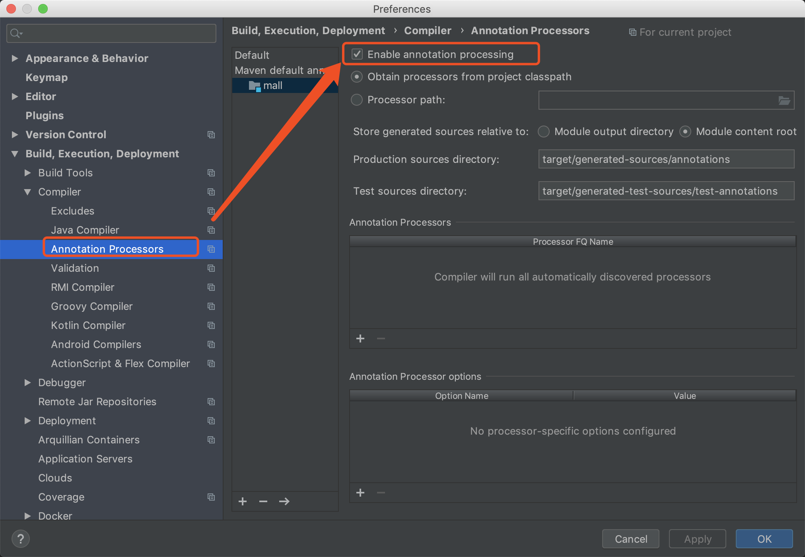

# Lombok的基本使用

> Java项目中，充斥着太多不友好的代码：POJO的getter/setter/toString；异常处理；I/O流的关闭操作等等，这些样板代码既没有技术含量，又影响着代码的美观，Lombok应运而生。
任何技术的出现都是为了解决某一类问题，如果在此基础上再建立奇技淫巧，不如回归Java本身，应该保持合理使用而不滥用。

**[官方地址](https://projectlombok.org/)，[github地址](https://github.com/rzwitserloot/lombok)。**


### 引入相应的maven包

``` xml
<dependency>
    <groupId>org.projectlombok</groupId>
    <artifactId>lombok</artifactId>
    <version>x.x.x</version>
    <scope>provided</scope>
</dependency>
```
- Lombok的**scope=provided**，说明它只在编译阶段生效，不需要打入包中。事实正是如此，Lombok在编译期将带Lombok注解的Java文件正确编译为完整的Class文件。

### 添加IDE工具对Lombok的支持

- 1.IDEA中引入Lombok支持,安装lombok插件


- 2.开启 AnnocationProcessors 开启该项是为了让Lombok注解在编译阶段起到作用。



### Lombok实现原理

  自从Java 6起，javac就支持“JSR 269 Pluggable Annotation Processing API”规范，只要程序实现了该API，就能在javac运行的时候得到调用。
Lombok就是一个实现了"JSR 269 API"的程序。在使用javac的过程中，它产生作用的具体流程如下：

- 1.javac对源代码进行分析，生成一棵抽象语法树(AST)
- 2.javac编译过程中调用实现了JSR 269的Lombok程序
- 3.此时Lombok就对第一步骤得到的AST进行处理，找到Lombok注解所在类对应的语法树(AST)，然后修改该语法树(AST)，增加Lombok注解定义的相应树节点
- 4.javac使用修改后的抽象语法树(AST)生成字节码文件


### Lombok注解的使用

##### POJO类常用注解:

- @Getter and @Setter
> 你可以用@Getter / @Setter注释任何字段（当然也可以注释到类上的），让lombok自动生成默认的getter / setter方法。
默认生成的方法是public的，如果要修改方法修饰符可以设置AccessLevel的值，例如：@Getter(access = AccessLevel.PROTECTED)

``` java
import lombok.AccessLevel;
import lombok.Getter;
import lombok.Setter;
public class User {
    @Getter(AccessLevel.PROTECTED) @Setter private Integer id;
    @Getter @Setter private String name;
    @Getter @Setter private String phone;
}
```


- @ToString
> 生成toString()方法，默认情况下，它会按顺序（以逗号分隔）打印你的类名称以及每个字段。可以这样设置不包含哪些字段@ToString(exclude = "id") / @ToString(exclude = {"id","name"})
如果继承的有父类的话，可以设置callSuper 让其调用父类的toString()方法，例如：@ToString(callSuper = true)

```java
import lombok.ToString;
@ToString(exclude = {"id","name"})
public class User {
  private Integer id;
  private String name;
  private String phone;
}
```

生成toString方法如下：

```java
public String toString(){
  return "User(phone=" + phone + ")";
}
```

- @EqualsAndHashCode
  
>生成hashCode()和equals()方法，默认情况下，它将使用所有非静态，非transient(数据库表字段中没有)字段。但可以通过在可选的exclude参数中来排除更多字段。或者，通过在parameter参数中命名它们来准确指定希望使用哪些字段。

```java
@EqualsAndHashCode(exclude={"id", "shape"})
public class EqualsAndHashCodeExample {
  private transient int transientVar = 10;
  private String name;
  private double score;
  private Shape shape = new Square(5, 10);
  private String[] tags;
  private transient int id;
  
  public String getName() {
    return this.name;
  }
  
  @EqualsAndHashCode(callSuper=true)
  public static class Square extends Shape {
    private final int width, height;
    
    public Square(int width, int height) {
      this.width = width;
      this.height = height;
    }
  }
}
```

对比代码如下：

```java
import java.util.Arrays;
public class EqualsAndHashCodeExample {
 private transient int transientVar = 10;
 private String name;
 private double score;
 private Shape shape = new Square(5, 10);
 private String[] tags;
 private transient int id;

 public String getName() {
   return this.name;
 }
 
 @Override public boolean equals(Object o) {
   if (o == this) return true;
   if (!(o instanceof EqualsAndHashCodeExample)) return false;
   EqualsAndHashCodeExample other = (EqualsAndHashCodeExample) o;
   if (!other.canEqual((Object)this)) return false;
   if (this.getName() == null ? other.getName() != null : !this.getName().equals(other.getName())) return false;
   if (Double.compare(this.score, other.score) != 0) return false;
   if (!Arrays.deepEquals(this.tags, other.tags)) return false;
   return true;
 }
 
 @Override public int hashCode() {
   final int PRIME = 59;
   int result = 1;
   final long temp1 = Double.doubleToLongBits(this.score);
   result = (result*PRIME) + (this.name == null ? 43 : this.name.hashCode());
   result = (result*PRIME) + (int)(temp1 ^ (temp1 >>> 32));
   result = (result*PRIME) + Arrays.deepHashCode(this.tags);
   return result;
 }
 
 protected boolean canEqual(Object other) {
   return other instanceof EqualsAndHashCodeExample;
 }
 
 public static class Square extends Shape {
   private final int width, height;
   
   public Square(int width, int height) {
     this.width = width;
     this.height = height;
   }
   
   @Override public boolean equals(Object o) {
     if (o == this) return true;
     if (!(o instanceof Square)) return false;
     Square other = (Square) o;
     if (!other.canEqual((Object)this)) return false;
     if (!super.equals(o)) return false;
     if (this.width != other.width) return false;
     if (this.height != other.height) return false;
     return true;
   }
   
   @Override public int hashCode() {
     final int PRIME = 59;
     int result = 1;
     result = (result*PRIME) + super.hashCode();
     result = (result*PRIME) + this.width;
     result = (result*PRIME) + this.height;
     return result;
   }
   
   protected boolean canEqual(Object other) {
     return other instanceof Square;
   }
 }
}
```


- @NoArgsConstructor, @RequiredArgsConstructor, @AllArgsConstructor

>@NoArgsConstructor生成一个无参构造方法。当类中有final字段没有被初始化时，编译器会报错，此时可用@NoArgsConstructor(force = true)，然后就会为没有初始化的final字段设置默认值 0 / false / null。对于具有约束的字段（例如@NonNull字段），不会生成检查或分配，因此请注意，正确初始化这些字段之前，这些约束无效。