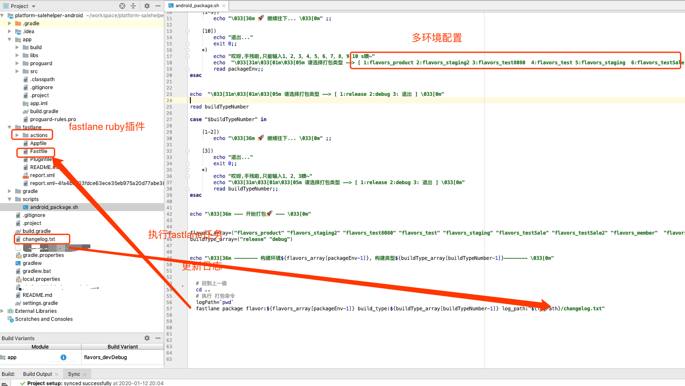
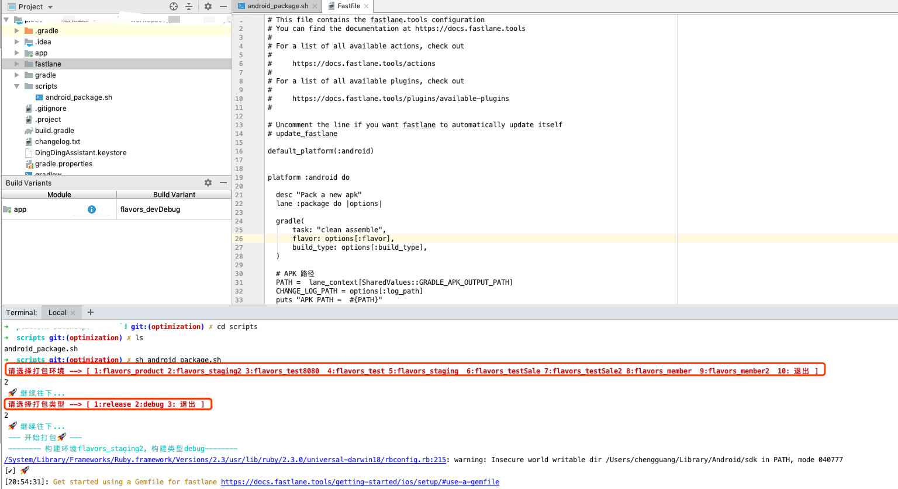
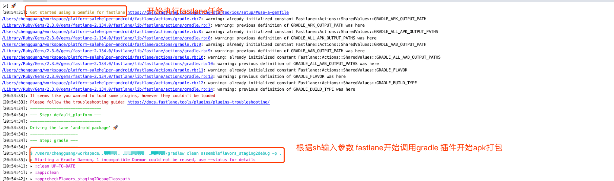
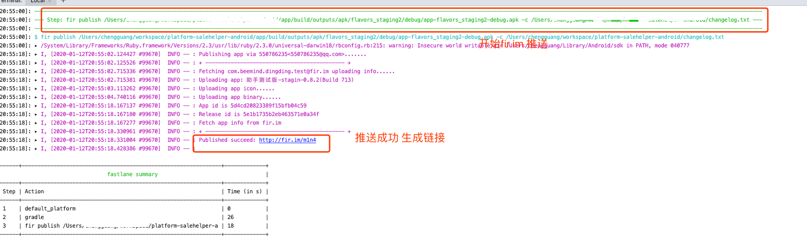

# Android fastlane自动化构建打包

> Fastlane is the easiest way to automate beta deployments and releases for your iOS and Android apps.
 * **fastlane 具体教程及文档请点击进入 [fastlane 使用文档](https://docs.fastlane.tools/)**  


## 项目目录结构


## android gradle多版本配置

```js
productFlavors {
        flavors_product {
            manifestPlaceholders = [str: "releaseStr", package_name: "xxxx",jpush_appkey: "eeee",type:""]
            applicationId "com.beemind.dingding"
            resValue "string", "app_name", "zzzz"
            buildConfigField "String", "BASE_URL", '"https://xxxx"'
            buildConfigField "String", "VERSION_TYPE", '"prod"'
            buildConfigField "String", "ML_DB_URL_TYPE", '"release"'
            buildConfigField "String", "WORK_ORDER_URL_estimate", '"https://xxxx"'
            buildConfigField "String", "WORK_ORDER_URL_main", '"https://xxxx"'
            buildConfigField "String", "WORK_ORDER_URL_product", '"https://xxx"'
            buildConfigField "int", "VOICE", '100'
        }

        flavors_dev {
        }
        flavors_test {
        }
        flavors_test8080 {
        }
        flavors_staging {
        }
        flavors_testSale {
        }
        flavors_testSale2 {
        }
        flavors_member2 {
        }
        flavors_member {
        }
        flavors_staging2 {
        }
    }
```


## sh 脚本编写
```shell
#!bin/sh


echo  "\033[31m\033[01m\033[05m 请选择打包环境 --> [ 1:flavors_product 2:flavors_staging2 3:flavors_test8080  4:flavors_test 5:flavors_staging  6:flavors_testSale 7:flavors_testSale2 8:flavors_member  9:flavors_member2  10: 退出 ] \033[0m"


read packageEnv

case "$packageEnv" in
    [1-9])
        echo "\033[36m 🚀 继续往下... \033[0m" ;;

    [10])
        echo "退出..." 
        exit 0;;
    *)
        echo "哎呀,手残啦,只能输入1，2，3，4，5，6，7，8，9,10 s噢~"
        echo  "\033[31m\033[01m\033[05m 请选择打包类型 --> [ 1:flavors_product 2:flavors_staging2 3:flavors_test8080  4:flavors_test 5:flavors_staging  6:flavors_testSale  7:flavors_testSale2 8:flavors_member  9:flavors_member2  10: 退出 ] \033[0m"
        read packageEnv;;
esac


echo  "\033[31m\033[01m\033[05m 请选择打包类型 --> [ 1:release 2:debug 3: 退出 ] \033[0m"

read buildTypeNumber

case "$buildTypeNumber" in

    [1-2])
        echo "\033[36m 🚀 继续往下... \033[0m" ;;

    [3])
        echo "退出..." 
        exit 0;;
    *)
        echo "哎呀,手残啦,只能输入1，2，3噢~"
        echo "\033[31m\033[01m\033[05m 请选择打包类型 --> [ 1:release 2:debug 3: 退出 ] \033[0m"
        read buildTypeNumber;;
esac


echo "\033[36m --- 开始打包🚀 --- \033[0m"


flavors_array=("flavors_product" "flavors_staging2" "flavors_test8080" "flavors_test" "flavors_staging" "flavors_testSale" "flavors_testSale2" "flavors_member"  "flavors_member2")
buildType_array=("release" "debug")


echo "\033[36m -------- 构建环境${flavors_array[packageEnv-1]}, 构建类型${buildType_array[buildTypeNumber-1]}-------- \033[0m"


  # 回到上一级
  cd ..
  # 执行 打包命令
  logPath=`pwd`
  fastlane package flavor:${flavors_array[packageEnv-1]} build_type:${buildType_array[buildTypeNumber-1]} log_path:"${logPath}/changelog.txt"
```

## fastlane 任务

```js
default_platform(:android)

platform :android do

  desc "Pack a new apk"
  lane :package do |options|

  gradle(
      task: "clean assemble",
      flavor: options[:flavor],
      build_type: options[:build_type],
  )

  # APK 路径
  PATH =  lane_context[SharedValues::GRADLE_APK_OUTPUT_PATH]
  CHANGE_LOG_PATH = options[:log_path]
  puts "APK PATH =  #{PATH}"
  puts "CHANGE LOG PATH =  #{CHANGE_LOG_PATH}"

  # 上传到 firim
  sh("fir","publish",PATH,"-c",CHANGE_LOG_PATH)
  
  end
end

```

> - 1.当sh执行到下面的脚本时 fastlane中的options 会接收到 floavor build_type log_path 三个入参
``` js
  fastlane package flavor:${flavors_array[packageEnv-1]} build_type:${buildType_array[buildTypeNumber-1]} log_path:"${logPath}/changelog.txt"
``` 
> - 2.fastlane 根据传入的参数 调用gradle插件 执行打包任务 ***需要提前安装gradle插件<br/>[fastlane插件安装流程](https://docs.fastlane.tools/plugins/using-plugins/) <br/>[gradle插件文档](https://docs.fastlane.tools/actions/gradle/#gradle)***
> - 3.打包完成调用执行下边的脚本 上传到fir.im。测试自行下载测试
``` js
 # 上传到 firim
  sh("fir","publish",PATH,"-c",CHANGE_LOG_PATH)
``` 


## 业务流程展示

- 1.选择打包环境类型
  

- 2.选择打包环境类型
  

- 3.fastlane开始自动构建
  

- 3.发布到fir平台

