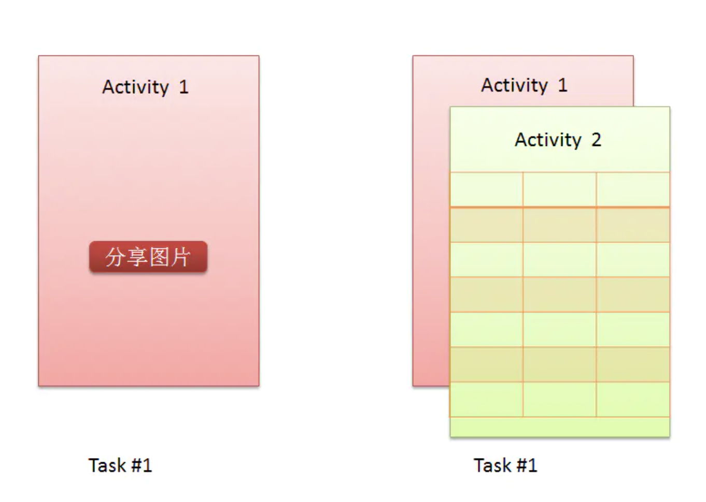
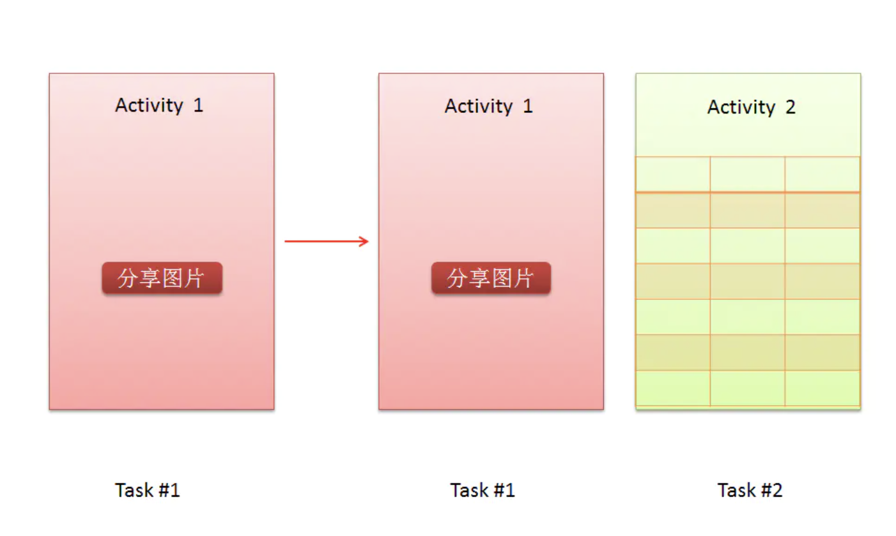
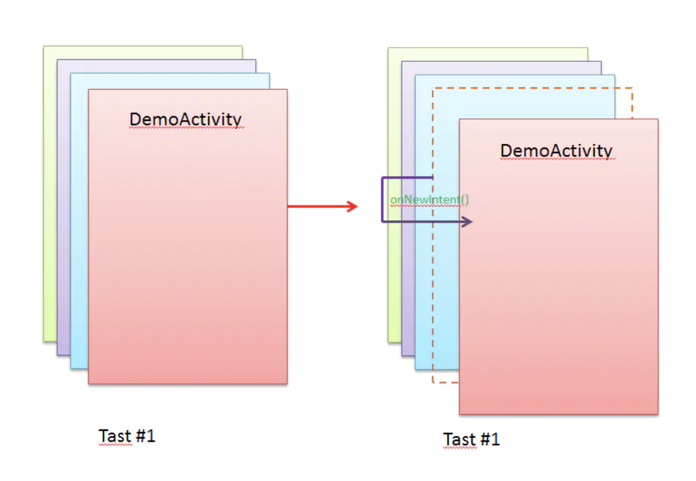
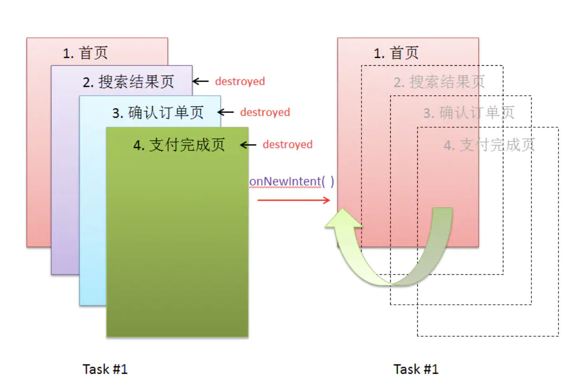
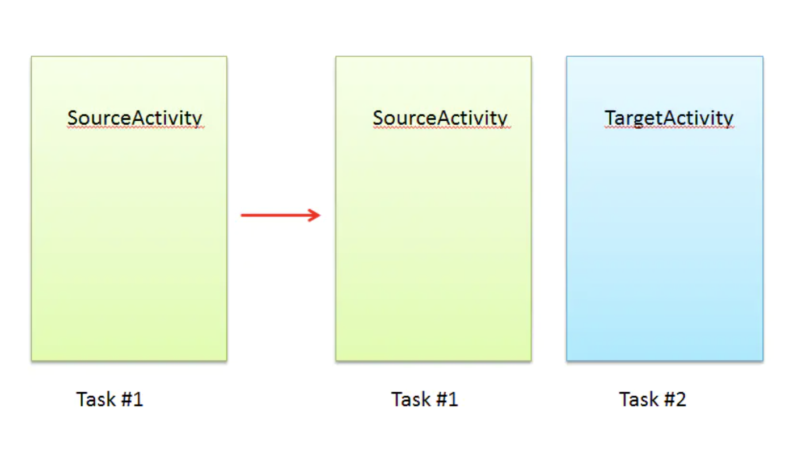

# Android Lanuch Mode

## Activity四种启动模式
- standard
- singleTop
- singleTask
- singleInstance

## standard

这是android中默认的启动启动方式，如果一个Activity的启动模式被设置成standard，那么它可以无限制的创建。你每一次通过Intent去启动这种模式的Activity都会重新创建一个。
<br/>另外说一点，standard模式在Android 5.0（Lollipop）之前和之后是有区别的。<br/>
　　
***Android Lollipop之前***

standard模式的Activity总是会被创建在启动它的Activity同一个任务栈中顶端（任务栈是一个栈结构，先进后出 First In Last Out），就算他们来自不同的应用。

如果你在A应用中要分享一个本地图片，这样会打开系统的图片查看应用中的图片选择器Activity，虽然这两个Activity来自不同的应用，但Android系统仍将会把他们放在同一个任务栈中，即A应用的任务栈中。



***Android Lollipop之后***

如果将要启动的Activity和启动它的Activity来自同一个应用，那没话说，和Lollipop之前一样，新的Activity会被创建在当前任务栈中的顶端。

但是如果它们来自不同的应用，那就会创建一个新的任务栈，再把要启动的Activity放在新的任务栈中，这时这个新启动的Activity就是新创建的任务站点的根Activity。



## singleTop

singleTop的意思就是“在顶部只能有一个”。

> 如果在启动这种模式的Activity的时候，当前任务栈的顶端已经存在了相同的Activity，那系统就不会再创建新的，而是回调任务栈中已经存在的该Activity的onNewIntent( )方法。




***应用场景:***
Android既然提供了这种启动模式，说明肯定有应有场景需要这样的方式。其实最常用的场景就是搜索，比方说我们在搜索框中输入想要搜索的内容点击搜索进入SearchResultActivty(搜索结果页)查看搜索的结果（一般我们也会在搜索结果页提供搜索框，这样用户无需点击返回键回到上一个页面再在搜索框中输入搜索内容点击搜索），如果此时用户还想搜点别的东西，就可以直接在当前的搜索结果页SearchResultActivty中的搜索框输入搜索内容继续搜索。

大家想象一下，如果我们把SearchResultActivty的启动模式设置为Standard的话会是什么样的景象。比如我们连着搜了10个内容，那就会启动10个不同的SearchResultActivty，然而这些SearchResultActivty功能完全一样，完全没有必要创建这么多，而且还有一个和上一节中的邮箱一样的问题，就是用户搜索结束想回到首页，那就还得按10次返回键才能回到首页，- -！

这时，singleTop启动模式就派上用场了，我们首先把SearchResultActivty的启动模式设置为singleTop，这样用户在SearchResultActivty页面中继续搜索的时候，我们只需把用户要搜索的内容放在Intent里面然后启动SearchResultActivty，这时系统并不会重新创建新的SearchResultActivty，而是回调当前任务栈栈顶的SearchResultActivty的onNewIntent()方法来接收带有用户搜索内容信息的Intent，然后我们拿到用户搜索内容后调搜索接口，并根据接口返回内容重新刷新布局即可，似不似很神奇？其实我们在上一节提到的邮箱的问题，也是用这种方式来解决的，原理和搜索一样的。

## singleTask

这种启动模式的Activity在Android系统中只允许存在一个实例。

如果系统中已经存在了该种启动模式的目标Activity，则系统并不会重新创建一个目标Activity，而是首先将持有目标Activity的整个任务栈都会被置于前台（用户可见），并且通过onNewIntent( )方法将启动目标Activity的Intent传递给目标Activity，置于目标Activity拿到这个Intent之后要做什么操作，系统就不管了，随便你拿来干什么，哼~。

但是这里有个问题，就是目标Activity和源Activity是不是来自同一应用。

***源Activity和目标Activity来自同一个应用***

这种情况要分两种情况说：

***当前系统中还没有目标Activity的实例***
这种情况最简单，直接在当前的任务栈中创建SingleTask模式的Activity并置于栈顶即可。

***当前系统中已经存在目标Activity的实例***
这种情况比较特殊，因为系统会把任务栈中目标Activity之上的所有Activity销毁，以让目标Activity处在栈顶的位置。

这里还要注意的是，因为目标Activity已经存在，系统不会重新创建，而是通过onNewIntent()的方式把Intent传递过来，这点和singleTop模式有些类似。注意了，这里让我们回想一下文章开头的我所说的场景，如何让用户在支付完成页直接跳转到首页，并把不需要的Activity销毁？SingleTask启动模式是不是刚好和我们的需求一致？



***源Activity和目标Activity来自不同应用***

这种情况还要两种情况说：

***当前系统中还没有目标Activity的实例***
这时系统首先会看任务管理器中是否有目标Actvity所在应用的任务栈？如果有的话，那就直接在目标Activity所在应用的任务栈的栈顶创建即可。

如果任务管理器中没有目标Activity所在应用的任务栈，系统就会创建其所在应用的任务栈和目标Activity，并且把目标Activity作为新建任务栈的根Activity。




***当前系统中已经存在目标Activity的实例***
目标Activity所在任务栈会被置于前台（即用户可见），而且也会把目标Activity之上的所有Actvity全部销毁。

## singleInstance

这种启动模式和singleTask几乎一样，它也只允许系统中存在一个目标Activity，包括上面我们所说的SingleTask的一些特性singleInstance都有。***唯一不同的是，持有目标Activity的任务栈中只能有目标Activity一个Actvitiy，不能再有别的Activity，就是承包了这个任务栈！***

singleInstance直译过来就是“单一实例”，有两层意思，：
- 1. 跟系统说，“我是独一无二的，不许和我一样的人存在！”，这就是说系统中存在一个目标Activity。；
- 2.  跟任务栈说，“我是独一无二的，不许你心里再装别的人！”，这就是说持有目标Activity的任务栈中只能有目标Activity一个Activity。

所以，如果要启动singleInstance模式的Activity,那只能新创建一个任务栈用来放它，因为人家说了，“我是独一无二的！”。同样的，如果从这种启动模式的Activity中启动别的Activity，那不好意思，我不管你是不是和我处在同一个应用，我所在的任务栈只能拥有我一个人，您呐，另外让系统给你创建一个任务栈待着去吧。


# 怎么使用启动模式？

## 在AndroidMenifest.xml文件中设置
```xml
<activity
  android:name=".wxapi.WXEntryActivity"
  android:exported="true"
  android:label="@string/app_name"
  android:launchMode="singleTask"/>
```


## 通过为Intent添加标识来设置
```java
  Intent intent = new Intent();
  intent.addFlags(Intent.FLAG_ACTIVITY_SINGLE_TOP)
```

- FLAG_ACTIVITY_NEW_TASK
与"singleTask"启动模式的作用一样。

- FLAG_ACTIVITY_SINGLE_TOP
与"singleTop"启动模式的作用一样。

- FLAG_ACTIVITY_CLEAR_TOP
这个标识的意思比较特殊。它不对应于我们上面所说的启动模式中的任何一种

我们来看一下android api中对这个标识的说明：

> 如果正在启动的 Activity 已在当前任务中运行，则会销毁当前任务顶部的所有 Activity，并通过onNewIntent()
将此 Intent 传递给 Activity 已恢复的实例（现在位于顶部），而不是启动该 Activity 的新实例。

