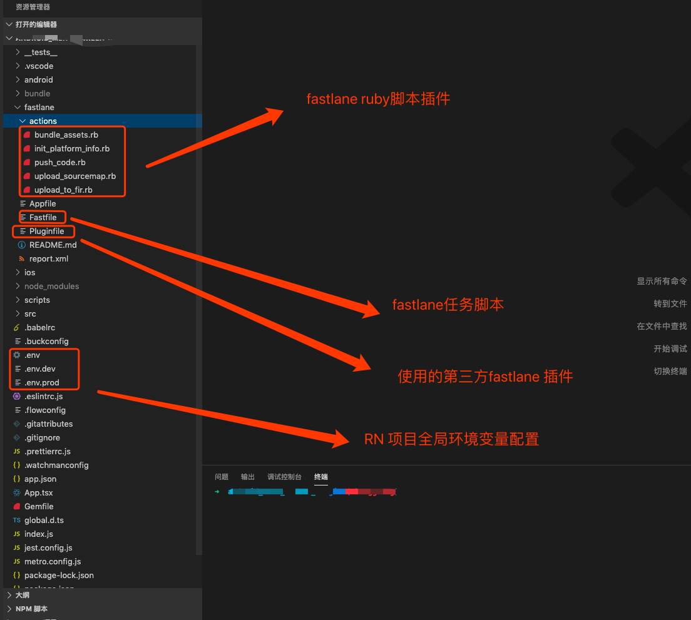
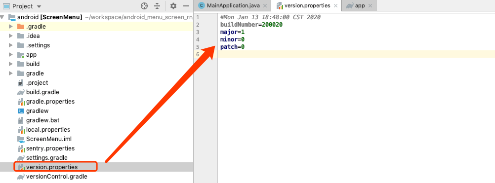
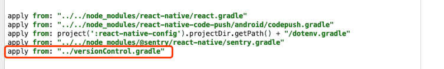
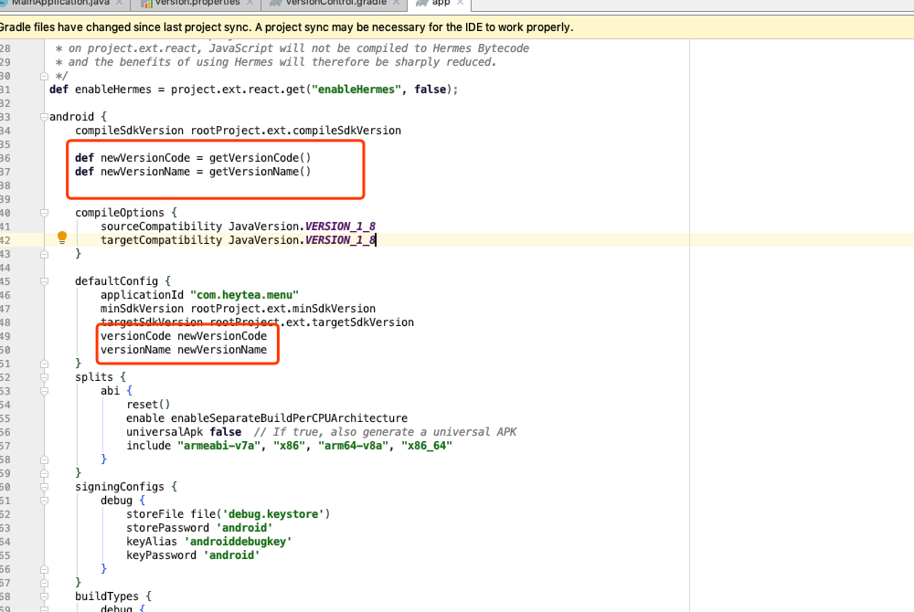

# RN fastlane自动化构建打包

> Fastlane is the easiest way to automate beta deployments and releases for your iOS and Android apps.
 * **fastlane 具体教程及文档请点击进入 [fastlane 使用文档](https://docs.fastlane.tools/)**  
 * **fastlane 自定义actions开发流程 [fastlane 自定义action](https://www.jianshu.com/p/44bbe1a31b52)**  


## 项目目录结构



## Fastfile lane任务说明
```js
fastlane_require 'dotenv'
# 加载.env 项目环境配置
Dotenv.load("../.env")

platform :android do
  # 初始化变量
  gradle_path = "./gradlew"
  project_dir = "./android"
  apk_directory = "/app/build/outputs/apk/release/app-release.apk"

  # 脚本执行前的准备
  desc "inject env variables"
    before_all do |lane, options|
      platform = "android"
      lane_context[SharedValues::PLATFORM_NAME] = platform
      # 初始化 fastlane 全局变量 下边介绍
      init_platform_info(platform: platform)
      env = options[:env] ? options[:env] : "dev"
      Dotenv.overload("../.env.#{env}")
  end

  # 安装一个release apk
  desc "install release apk"
  lane :install do
    sh "adb install ../android#{apk_directory}"
  end

  # 构建一个release apk
  desc "build a release apk"
  lane :build_apk do |options|
    # react-native-config
    shellcommand = "export ENVFILE=.env.#{ENV["APP_ENV"]} && cd ../android && ./gradlew clean && ./gradlew assembleRelease"
    sh shellcommand
  end

  # 构建一个release 并发布到fir.im
  desc "distribute a beta version to fir"
  lane :beta do
    build_apk()
    upload_to_fir(
      path: "./android#{apk_directory}",
    )
    # install()
  end


  desc "distribute an app to app store"
  lane :release do |options|
    Dotenv.overload("../.env.prod")
    # 执行gradle脚本 更新版本号
    bump_type = options[:bump_type] || "patch"
    gradle(
      task: "doVersionIncrement",
      flags: "-q -Pbump_type=#{bump_type}",
      project_dir: project_dir,
      gradle_path: gradle_path,
    )
    gradle(
      task: "doVersionCodeIncrement",
      flags: "-q",
      project_dir: project_dir,
      gradle_path: gradle_path,
    )
    build_apk()
  end

  lane :install_release do |options|
    Dotenv.overload("../.env.prod")
    build_apk()
    install()
  end


  # 打包bundle文件 并推送到copepush
  desc "codePush assets"
  lane :codePush do |options|
    bundle_assets()
    log = options[:log] ? options[:log] : ""
    push_code(log: log)
    upload_sourcemap()
  end

end
```

## 环境变量设置（.env .env.dev .env.prod）

```js 
BaseUrl=xxx
MIN_VERSION=1.0.0
CODE_PUSH=Staging
APP_ENV=dev
SENTRY_AUTH_TOKEN=xxxx
SENTRY_ORG=heytea
SENTRY_PROJECT=xxxx
FIR_TOKEN=xxxx
```


## init_platform_info.rb 初始fastlane全局变量
```ruby
module Fastlane
  module Actions
    module SharedValues
      APP_VERSION = :APP_VERSION
      BUILD_NUMBER = :BUILD_NUMBER
      RELEASE_TAG = :RELEASE_TAG
      BUNDLE_FILE_NAME = :BUNDLE_FILE_NAME
    end

    class InitPlatformInfoAction < Action
      def self.run(params)
        platform = params[:platform]
        puts("InitPlatformInfoAction Action....... #{params[:platform]}")
        if platform == "ios"
          iosPath = "../ios/investor/Info.plist"
          Actions.lane_context[SharedValues::APP_VERSION] = other_action.get_info_plist_value(path: iosPath, key: "CFBundleShortVersionString")

          Actions.lane_context[SharedValues::BUILD_NUMBER] = other_action.get_info_plist_value(path: iosPath, key: "CFBundleVersion")

          Actions.lane_context[SharedValues::BUNDLE_FILE_NAME] = "main.jsbundle"
        elsif platform == "android"
          # 获取android版本
          androidPath = "../android/version.properties"
          major = other_action.gradle_properties(path: androidPath, property_name: "major")
          minor = other_action.gradle_properties(path: androidPath, property_name: "minor")
          patch = other_action.gradle_properties(path: androidPath, property_name: "patch")
          Actions.lane_context[SharedValues::APP_VERSION] = "#{major}.#{minor}.#{patch}"
          Actions.lane_context[SharedValues::BUILD_NUMBER] = other_action.gradle_properties(path: androidPath, property_name: "buildNumber")

          Actions.lane_context[SharedValues::BUNDLE_FILE_NAME] = "index.android.bundle"
        end

        bundleTime = Time.now.strftime("%Y%m%d-%H:%M")
        commitHash = other_action.last_git_commit()[:abbreviated_commit_hash]
        Actions.lane_context[SharedValues::RELEASE_TAG] = "#{platform}-#{commitHash}-#{bundleTime}"
      end

      #####################################################
      # @!group Documentation
      #####################################################

      def self.description
        "A short description with <= 80 characters of what this action does"
      end

      def self.details
        # Optional:
        # this is your chance to provide a more detailed description of this action
        "You can use this action to do cool things..."
      end

      def self.available_options
        # Define all options your action supports.

        # Below a few examples
        [FastlaneCore::ConfigItem.new(
          key: :platform,
          env_name: "EXECUTE_PLATFORM",
          description: "current platform",
          is_string: true,
        )]
      end

      def self.output
        # Define the shared values you are going to provide
        # Example
        [
          ["INIT_PLATFORM_INFO_CUSTOM_VALUE", "A description of what this value contains"],
        ]
      end

      def self.return_value
        # If your method provides a return value, you can describe here what it does
      end

      def self.authors
        # So no one will ever forget your contribution to fastlane :) You are awesome btw!
        ["Your GitHub/Twitter Name"]
      end

      def self.is_supported?(platform)
        # you can do things like
        #
        #  true
        #
        #  platform == :ios
        #
        [:ios, :android].include?(platform)
        #

        # platform == :ios
      end
    end
  end
end
``` 

> 获取工程基本配置 APP_VERSION版本号 （***android version.properties配置稍后介绍***） BUILD_NUMBER 构建number、 RELEASE_TAG 构建标识、 BUNDLE_FILE_NAME bundle文件名
> 
## bundle_assets.rb bundle文件打包
```ruby
module Fastlane
  module Actions
    module SharedValues
      RELEASE_TAG = :RELEASE_TAG
    end

    class BundleAssetsAction < Action
      def self.run(params)
        platform = lane_context[SharedValues::PLATFORM_NAME]
        bundleName = Actions.lane_context[SharedValues::BUNDLE_FILE_NAME]
        bundleDir = "./bundle/#{platform}"
        sourceMapDir = "./bundle/sourcemap"

        FileUtils.rm_rf(Dir["#{bundleDir}/*", "#{sourceMapDir}/*"])
        UI.important("clean bundle content success")

        releaseTag = Actions.lane_context[SharedValues::RELEASE_TAG]

        shellcommand = "releaseTag='#{releaseTag}' react-native bundle --reset-cache --assets-dest #{bundleDir} --bundle-output #{bundleDir}/#{bundleName} --sourcemap-output #{sourceMapDir}/#{bundleName}.map --dev false --entry-file index.js --platform #{platform}"
        sh shellcommand
      end

      #####################################################
      # @!group Documentation
      #####################################################

      def self.description
        "A short description with <= 80 characters of what this action does"
      end

      def self.details
        # Optional:
        # this is your chance to provide a more detailed description of this action
        "You can use this action to do cool things..."
      end

      def self.available_options
        []
      end

      def self.output
        # Define the shared values you are going to provide
        # Example
        [
          ["BUNDLE_ASSETS_CUSTOM_VALUE", "A description of what this value contains"],
        ]
      end

      def self.return_value
        # If your method provides a return value, you can describe here what it does
      end

      def self.authors
        # So no one will ever forget your contribution to fastlane :) You are awesome btw!
        ["Your GitHub/Twitter Name"]
      end

      def self.is_supported?(platform)
        # you can do things like
        #
        #  true
        #
        #  platform == :ios
        #
        [:ios, :android].include?(platform)
        #

        # platform == :ios
      end
    end
  end
end
```


## code_push.rb codePush推送
```ruby
module Fastlane
  module Actions
    module SharedValues
      PUSH_CODE_CUSTOM_VALUE = :PUSH_CODE_CUSTOM_VALUE
    end

    class PushCodeAction < Action
      def self.run(params)
        platform = lane_context[SharedValues::PLATFORM_NAME]
        puts("push_code log Action....... #{params[:log]}")
        if platform == "ios"
          appName = "ios 暂无"
        elsif platform == "android"
          appName = "ScreenMenu_Android"
          codepushLog = params[:log]
        end

        appVersion = Actions.lane_context[SharedValues::APP_VERSION]

        version = ENV["MIN_VERSION"] == appVersion ? appVersion : "#{ENV["MIN_VERSION"]}-#{appVersion}"
        bundleDir = "./bundle/#{platform}"
        shellcommand = "code-push release-react #{appName} #{platform} -o #{bundleDir} -t '#{version}' -d #{ENV["CODE_PUSH"]} --des #{codepushLog}  --mandatory false"
                               

        begin
          sh shellcommand
        rescue => ex
          UI.error(ex)
        end
      end

      #####################################################
      # @!group Documentation
      #####################################################

      def self.description
        "A short description with <= 80 characters of what this action does"
      end

      def self.details
        # Optional:
        # this is your chance to provide a more detailed description of this action
        "You can use this action to do cool things..."
      end

      def self.available_options
        # Define all options your action supports.

        # Below a few examples
        [FastlaneCore::ConfigItem.new(
          key: :log,
          description: "code push log",
          default_value:'',
          is_string: true,
        )]
      end

      def self.output
        # Define the shared values you are going to provide
        # Example
        [
          ["PUSH_CODE_CUSTOM_VALUE", "A description of what this value contains"],
        ]
      end

      def self.return_value
        # If your method provides a return value, you can describe here what it does
      end

      def self.authors
        # So no one will ever forget your contribution to fastlane :) You are awesome btw!
        ["Your GitHub/Twitter Name"]
      end

      def self.is_supported?(platform)
        # you can do things like
        #
        #  true
        #
        #  platform == :ios
        #
        #  [:ios, :mac].include?(platform)
        #
        [:ios, :android].include?(platform)
      end
    end
  end
end

```


## upload_to_fir.rb apk推送到fir.im

```ruby
module Fastlane
  module Actions
    module SharedValues
      UPLOAD_TO_FIR_CUSTOM_VALUE = :UPLOAD_TO_FIR_CUSTOM_VALUE
    end

    class UploadToFirAction < Action
      def self.run(params)
        path = params[:path]
        shellcommand = "fir publish '#{path}' -T #{ENV["FIR_TOKEN"]} -c $1"
        sh shellcommand
      end

      #####################################################
      # @!group Documentation
      #####################################################

      def self.description
        "A short description with <= 80 characters of what this action does"
      end

      def self.details
        # Optional:
        # this is your chance to provide a more detailed description of this action
        "You can use this action to do cool things..."
      end

      def self.available_options
        # Define all options your action supports.

        # Below a few examples
        [
          FastlaneCore::ConfigItem.new(key: :path,
                                       env_name: "UPLOAD_TO_FIR", # The name of the environment variable
                                       description: "apk or ipa path" # a short description of this parameter
            ),
        ]
      end

      def self.output
        # Define the shared values you are going to provide
        # Example
        [
          ["UPLOAD_TO_FIR_CUSTOM_VALUE", "A description of what this value contains"],
        ]
      end

      def self.return_value
        # If your method provides a return value, you can describe here what it does
      end

      def self.authors
        # So no one will ever forget your contribution to fastlane :) You are awesome btw!
        ["Your GitHub/Twitter Name"]
      end

      def self.is_supported?(platform)
        # you can do things like
        #
        #  true
        #
        #  platform == :ios
        #
        [:ios, :android].include?(platform)
        #

      end
    end
  end
end
```


## Android端 version.properties配置
 * **参考文档 [android 自动更新version](https://medium.com/@marselx/android-project-setup-part-2-fastlane-integration-ecddd54c6311)**  


### versionControl.gradle 脚本
``` js
// 读取版本配置信息
def readVersion() {
    def versionFile  = new File(project.rootDir, 'version.properties')
    def version = new Properties()
    def stream
    try {
        stream = new FileInputStream(versionFile)
        version.load(stream)
    } catch (FileNotFoundException ignore) {
    } finally {
        if (stream != null) stream.close()
    }
    return version
}

def getVersionName() {
    def version = readVersion()
    def versionName = "${version.major}.${version.minor}.${version.patch}"
    return versionName
}

def incrementVersionName(def type="patch") {
    println "incrementVersionName type ==>> ${type}"
    def version = readVersion()
    def major = version.major as int
    def minor = version.minor as int
    def patch = version.patch as int
    if(type == 'major') {
        major++
        minor = 0
        patch = 0
    } else if(type == 'minor') {
        minor++
        patch = 0
    } else if(type == 'patch') {
        patch ++
    }

    version.major = major.toString()
    version.minor = minor.toString()
    version.patch = patch.toString()
    version.buildNumber = version.buildNumber

    def versionFile  = new File(project.rootDir, 'version.properties')
    def stream = new FileOutputStream(versionFile)
    try {
        version.store(stream, null)
    } finally {
        stream.close()
    }

    def versionName = "${version.major}.${version.minor}.${version.patch}"
    return versionName
}

def getVersionCode() {
    def buildnum = 200000
    try {
        def getGit = 'git rev-list --count HEAD'.execute()
        def gitVersion = getGit.text.trim().toInteger()
        buildnum = buildnum + gitVersion
    } catch (e) {
        e.printStackTrace()
    }
    return buildnum
}

def setVersionCode() {
    def buildNumber = 200000
    try {
        def getGit = 'git rev-list --count HEAD'.execute()
        def gitVersion = getGit.text.trim().toInteger()
        buildNumber = buildNumber + gitVersion
    } catch (e) {
        e.printStackTrace()
    }
    version = readVersion()
    version.major = version.major
    version.minor = version.minor
    version.patch = version.patch
    version.buildNumber = buildNumber.toString()
    def versionFile  = new File(project.rootDir, 'version.properties')
    def stream = new FileOutputStream(versionFile)
    try {
        version.store(stream, null)
    } finally {
        stream.close()
    }
    return buildNumber
}

task doVersionCodeIncrement {
    def versionCode = setVersionCode()
    println "versionCode ==>> ${versionCode}"
}

task doVersionIncrement {
    def versionName = incrementVersionName(project.getProperties().get("bump_type"))
    println "versionName ==>> ${versionName}"
}

ext {
    getVersionName = this.&getVersionName
    getVersionCode = this.&getVersionCode
}
```

### app/build.gradle 配置
* **在文件头部添加 apply from: "../versionControl.gradle"**
  
* **在android {}节点下添加**
  


## Android 打包说明
* 1.当执行 fastlane android release bump_type:"patch" 命令，Dotenv.overload("../.env.prod") 读取项目环境变量。
* 2.触发fastlane gralde插件，并调用versionControl.gradle脚本中 doVersionIncrement doVersionCodeIncrement两个task 执行，对版本号进行自增。
* 3.调用build_apk() 打包任务打包apk文件
* 4.调用upload_to_fir 推送apk 到fir.im
```js 
desc "distribute an app to app store"
  lane :release do |options|
    Dotenv.overload("../.env.prod")
    # 执行gradle脚本 更新版本号
    bump_type = options[:bump_type] || "patch"
    gradle(
      task: "doVersionIncrement",
      flags: "-q -Pbump_type=#{bump_type}",
      project_dir: project_dir,
      gradle_path: gradle_path,
    )
    gradle(
      task: "doVersionCodeIncrement",
      flags: "-q",
      project_dir: project_dir,
      gradle_path: gradle_path,
    )
    build_apk()
    upload_to_fir(
      path: "./android#{apk_directory}",
    )
  end
```


## RN打包说明
* 1. 当执行 fastlane android codePush log:"打包日志"，调用 bundle_assets.rb 对bundle进行打包
* 2. 读取log参数 调用push_code.rb 推送到codepush托管平台
* 3. 执行upload_sourcemap.rb 推送到sentry（sentry 错误日志平台）

```js 
desc "codePush assets"
  lane :codePush do |options|
    bundle_assets()
    log = options[:log] ? options[:log] : ""
    push_code(log: log)
    upload_sourcemap()
  end
```