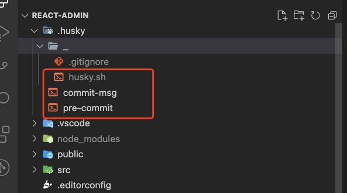
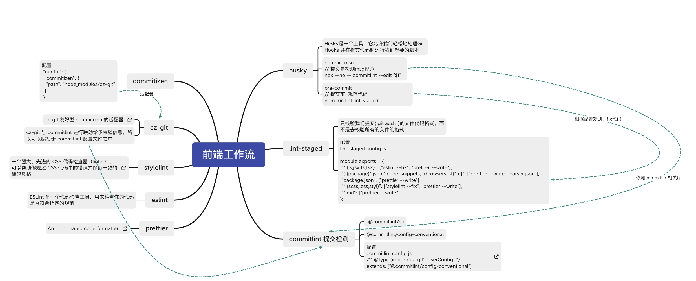

# 使用 husky、commitlint 和 lint-staged 来构建你的前端工作流

#### 背景
> - 在团队开发时，每个人提交的**commit message**都风格各异，在大型项目中会导致追溯提交记录异常困难，需要统一规范message格式
> - 在提交代码后，发现少了一个分号，或者多了一个**console.log**，所以在**commit**需要做代码校验，修正代码风格


#### 使用工具
|  工具   | 作用  |
|  ----  | ----  |
| Prettier  | 代码美化规范工具 |
| Eslint  | 代码美化规范工具 |
| husky  | 一个为git客户端增加 hook 的工具，比如 pre-commit 钩子就会在你执行 git commit 的触发 |
| lint-staged  | 是一个在 git 暂存文件上（也就是被 git add 的文件）运行已配置的 linter（或其他）任务。lint-staged 总是将所有暂存文件的列表传递给任务 |
| commitlint  | 可以帮助我们 lint commit messages, 如果提交的不符合指向的规范, 直接拒绝提交 |
| commitizen  | 基于Node.js的 git commit 命令行工具，辅助生成标准化规范化的 commit message。 |
| [cz-git](https://cz-git.qbb.sh/zh/guide/why)  | 一款工程性更强，轻量级，高度自定义，标准输出格式的 commitizen 适配器 |


#### 代码规范
***************************
##### 代码检查工具
- **Eslint**
- 项目集成

```
npm install --save-dev eslint
npx eslint --init
```
- **init** 命令会自动生成 **.eslintrc.js**

**[.prettierrc.js配置](http://eslint.cn)**
```js
// @see: http://eslint.cn
module.exports = {
	settings: {
		react: {
			version: "detect"
		}
	},
	root: true,
	env: {
		browser: true,
		node: true,
		es6: true
	},
	/* 指定如何解析语法 */
	parser: "@typescript-eslint/parser",
	/* 优先级低于 parse 的语法解析配置 */
	parserOptions: {
		ecmaVersion: 2020,
		sourceType: "module",
		jsxPragma: "React",
		ecmaFeatures: {
			jsx: true
		}
	},
	plugins: ["react", "@typescript-eslint", "react-hooks", "prettier"],
	/* 继承某些已有的规则 */
	extends: [
		"eslint:recommended",
		"plugin:react/recommended",
		"plugin:@typescript-eslint/recommended",
		"plugin:react/jsx-runtime",
		"plugin:react-hooks/recommended",
		"prettier",
		"plugin:prettier/recommended"
	],
	/*
	 * "off" 或 0    ==>  关闭规则
	 * "warn" 或 1   ==>  打开的规则作为警告（不影响代码执行）
	 * "error" 或 2  ==>  规则作为一个错误（代码不能执行，界面报错）
	 */
	rules: {
		// eslint (http://eslint.cn/docs/rules)
		"no-var": "error", // 要求使用 let 或 const 而不是 var
		"no-multiple-empty-lines": ["error", { max: 1 }], // 不允许多个空行
		"no-use-before-define": "off", // 禁止在 函数/类/变量 定义之前使用它们
		"prefer-const": "off", // 此规则旨在标记使用 let 关键字声明但在初始分配后从未重新分配的变量，要求使用 const
		"no-irregular-whitespace": "off", // 禁止不规则的空白

		// typeScript (https://typescript-eslint.io/rules)
		"@typescript-eslint/no-unused-vars": "error", // 禁止定义未使用的变量
		"@typescript-eslint/no-inferrable-types": "off", // 可以轻松推断的显式类型可能会增加不必要的冗长
		"@typescript-eslint/no-namespace": "off", // 禁止使用自定义 TypeScript 模块和命名空间。
		"@typescript-eslint/no-explicit-any": "off", // 禁止使用 any 类型
		"@typescript-eslint/ban-ts-ignore": "off", // 禁止使用 @ts-ignore
		"@typescript-eslint/ban-types": "off", // 禁止使用特定类型
		"@typescript-eslint/explicit-function-return-type": "off", // 不允许对初始化为数字、字符串或布尔值的变量或参数进行显式类型声明
		"@typescript-eslint/no-var-requires": "off", // 不允许在 import 语句中使用 require 语句
		"@typescript-eslint/no-empty-function": "off", // 禁止空函数
		"@typescript-eslint/no-use-before-define": "off", // 禁止在变量定义之前使用它们
		"@typescript-eslint/ban-ts-comment": "off", // 禁止 @ts-<directive> 使用注释或要求在指令后进行描述
		"@typescript-eslint/no-non-null-assertion": "off", // 不允许使用后缀运算符的非空断言(!)
		"@typescript-eslint/explicit-module-boundary-types": "off", // 要求导出函数和类的公共类方法的显式返回和参数类型

		// react (https://github.com/jsx-eslint/eslint-plugin-react)
		"react-hooks/rules-of-hooks": "error",
		"react-hooks/exhaustive-deps": "off"
	}
};
```

****************************************************************

##### 代码风格工具
- **prettier**
- 项目集成

```
npm install --save-dev eslint-config-prettier eslint-plugin-prettier
```
- 在.eslintrc 中,extend中添加 "prettier" 解决 eslint 和 prettier 的冲突
  > 因为eslint-config-prettier新版本更新之后,只需要写一个 "prettierr" 即可,无需多言指令
- 创建 .prettierrc


**.prettierrc.js配置**

```js
// @see: https://www.prettier.cn
module.exports = {
	// 超过最大值换行
	printWidth: 130,
	// 缩进字节数
	tabWidth: 2,
	// 使用制表符而不是空格缩进行
	useTabs: true,
	// 结尾不用分号(true有，false没有)
	semi: true,
	// 使用单引号(true单双引号，false双引号)
	singleQuote: false,
	// 更改引用对象属性的时间 可选值"<as-needed|consistent|preserve>"
	quoteProps: "as-needed",
	// 在对象，数组括号与文字之间加空格 "{ foo: bar }"
	bracketSpacing: true,
	// 多行时尽可能打印尾随逗号。（例如，单行数组永远不会出现逗号结尾。） 可选值"<none|es5|all>"，默认none
	trailingComma: "none",
	// 在JSX中使用单引号而不是双引号
	jsxSingleQuote: false,
	//  (x) => {} 箭头函数参数只有一个时是否要有小括号。avoid：省略括号 ,always：不省略括号
	arrowParens: "avoid",
	// 如果文件顶部已经有一个 doclock，这个选项将新建一行注释，并打上@format标记。
	insertPragma: false,
	// 指定要使用的解析器，不需要写文件开头的 @prettier
	requirePragma: false,
	// 默认值。因为使用了一些折行敏感型的渲染器（如GitHub comment）而按照markdown文本样式进行折行
	proseWrap: "preserve",
	// 在html中空格是否是敏感的 "css" - 遵守CSS显示属性的默认值， "strict" - 空格被认为是敏感的 ，"ignore" - 空格被认为是不敏感的
	htmlWhitespaceSensitivity: "css",
	// 换行符使用 lf 结尾是 可选值"<auto|lf|crlf|cr>"
	endOfLine: "auto",
	// 这两个选项可用于格式化以给定字符偏移量（分别包括和不包括）开始和结束的代码
	rangeStart: 0,
	rangeEnd: Infinity,
	// Vue文件脚本和样式标签缩进
	vueIndentScriptAndStyle: false
};
```

#### git规范
****************************************************************
> Git有很多的hooks, 让我们在不同的阶段,对代码进行不同的操作,控制提交到仓库的代码的规范性,和准确性, 以下只是几个常用的钩子

##### [常用的husky钩子](https://git-scm.com/book/zh/v2/%E8%87%AA%E5%AE%9A%E4%B9%89-Git-Git-%E9%92%A9%E5%AD%90)

- **pre-commit** 描述: 通过钩子函数,判断提交的代码是否符合规范
- **commit-msg** 描述: 通过钩子函数,判断 commit 信息是否符合规范
- **pre-push**   描述: 通过钩子,执行测试,避免对以前的内容造成影响

###### 图例:
<br>


##### 注意事项
> - 1. git config core.hooksPath .husky 配置git hooks文件目录，这样git commit 时才会执行指定hooks目录下钩子
> - 2. npx husky-init 生成 .husky/_/husky.sh 脚本
> - 3. 需要配置文件可执行权限 chmod +x .husky/pre-commit  chmod +x .husky/commit-msg


##### [husky钩子配置](https://typicode.github.io/husky/#/)

**commit-msg钩子**
> ```npx husky add .husky/commit-msg 'npx --no -- commitlint --edit "$1"'```
```shell
#!/usr/bin/env sh
. "$(dirname -- "$0")/_/husky.sh"
#--no-install 参数表示强制npx使用项目中node_modules目录中的commitlint包
npx --no -- commitlint --edit "$1"
```
> **commitlint** 需要依赖  **commitlint/cli**库
<br>

****************************************************************

**pre-commit钩子**
> ```npx husky add .husky/pre-commit "npm run lint:lint-staged"```

```shell
#!/usr/bin/env sh
. "$(dirname -- "$0")/_/husky.sh"

npm run lint:lint-staged
```
> [**lint-staged**](https://github.com/okonet/lint-staged) 针对暂存的 git 文件运行 linters，不要让 💩 溜进你的代码库！


****************************************************************

**lint-staged.config.js 配置**

```javascript
module.exports = {
	"*.{js,jsx,ts,tsx}": ["eslint --fix", "prettier --write"],
	"{!(package)*.json,*.code-snippets,.!(browserslist)*rc}": ["prettier --write--parser json"],
	"package.json": ["prettier --write"],
	"*.{scss,less,styl}": ["stylelint --fix", "prettier --write"],
	"*.md": ["prettier --write"]
};
```

**commitlint.config.js 配置**

```javascript
// @see: https://cz-git.qbenben.com/zh/guide
/** @type {import('cz-git').UserConfig} */

module.exports = {
	ignores: [commit => commit.includes("init")],
	extends: ["@commitlint/config-conventional"],
	rules: {
		// @see: https://commitlint.js.org/#/reference-rules
		"body-leading-blank": [2, "always"],
		"footer-leading-blank": [1, "always"],
		"header-max-length": [2, "always", 108],
		"subject-empty": [2, "never"],
		"type-empty": [2, "never"],
		"subject-case": [0],
		"type-enum": [
			2,
			"always",
			[
				"feat",
				"fix",
				"docs",
				"style",
				"refactor",
				"perf",
				"test",
				"build",
				"ci",
				"chore",
				"revert",
				"wip",
				"workflow",
				"types",
				"release"
			]
		]
	},
	prompt: {
		messages: {
			type: "Select the type of change that you're committing:",
			scope: "Denote the SCOPE of this change (optional):",
			customScope: "Denote the SCOPE of this change:",
			subject: "Write a SHORT, IMPERATIVE tense description of the change:\n",
			body: 'Provide a LONGER description of the change (optional). Use "|" to break new line:\n',
			breaking: 'List any BREAKING CHANGES (optional). Use "|" to break new line:\n',
			footerPrefixsSelect: "Select the ISSUES type of changeList by this change (optional):",
			customFooterPrefixs: "Input ISSUES prefix:",
			footer: "List any ISSUES by this change. E.g.: #31, #34:\n",
			confirmCommit: "Are you sure you want to proceed with the commit above?"
			// 中文版
			// type: "选择你要提交的类型 :",
			// scope: "选择一个提交范围（可选）:",
			// customScope: "请输入自定义的提交范围 :",
			// subject: "填写简短精炼的变更描述 :\n",
			// body: '填写更加详细的变更描述（可选）。使用 "|" 换行 :\n',
			// breaking: '列举非兼容性重大的变更（可选）。使用 "|" 换行 :\n',
			// footerPrefixsSelect: "选择关联issue前缀（可选）:",
			// customFooterPrefixs: "输入自定义issue前缀 :",
			// footer: "列举关联issue (可选) 例如: #31, #I3244 :\n",
			// confirmCommit: "是否提交或修改commit ?"
		},
		types: [
			{
				value: "feat",
				name: "feat:     🚀  A new feature",
				emoji: "🚀"
			},
			{
				value: "fix",
				name: "fix:      🧩  A bug fix",
				emoji: "🧩"
			},
			{
				value: "docs",
				name: "docs:     📚  Documentation only changes",
				emoji: "📚"
			},
			{
				value: "style",
				name: "style:    🎨  Changes that do not affect the meaning of the code",
				emoji: "🎨"
			},
			{
				value: "refactor",
				name: "refactor: ♻️   A code change that neither fixes a bug nor adds a feature",
				emoji: "♻️"
			},
			{
				value: "perf",
				name: "perf:     ⚡️  A code change that improves performance",
				emoji: "⚡️"
			},
			{
				value: "test",
				name: "test:     ✅  Adding missing tests or correcting existing tests",
				emoji: "✅"
			},
			{
				value: "build",
				name: "build:    📦️   Changes that affect the build system or external dependencies",
				emoji: "📦️"
			},
			{
				value: "ci",
				name: "ci:       🎡  Changes to our CI configuration files and scripts",
				emoji: "🎡"
			},
			{
				value: "chore",
				name: "chore:    🔨  Other changes that don't modify src or test files",
				emoji: "🔨"
			},
			{
				value: "revert",
				name: "revert:   ⏪️  Reverts a previous commit",
				emoji: "⏪️"
			}
			// 中文版
			// { value: "特性", name: "特性:   🚀  新增功能", emoji: "🚀" },
			// { value: "修复", name: "修复:   🧩  修复缺陷", emoji: "🧩" },
			// { value: "文档", name: "文档:   📚  文档变更", emoji: "📚" },
			// { value: "格式", name: "格式:   🎨  代码格式（不影响功能，例如空格、分号等格式修正）", emoji: "🎨" },
			// { value: "重构", name: "重构:   ♻️  代码重构（不包括 bug 修复、功能新增）", emoji: "♻️" },
			// { value: "性能", name: "性能:   ⚡️  性能优化", emoji: "⚡️" },
			// { value: "测试", name: "测试:   ✅  添加疏漏测试或已有测试改动", emoji: "✅" },
			// { value: "构建", name: "构建:   📦️  构建流程、外部依赖变更（如升级 npm 包、修改 webpack 配置等）", emoji: "📦️" },
			// { value: "集成", name: "集成:   🎡  修改 CI 配置、脚本", emoji: "🎡" },
			// { value: "回退", name: "回退:   ⏪️  回滚 commit", emoji: "⏪️" },
			// { value: "其他", name: "其他:   🔨  对构建过程或辅助工具和库的更改（不影响源文件、测试用例）", emoji: "🔨" }
		],
		useEmoji: true,
		themeColorCode: "",
		scopes: [],
		allowCustomScopes: true,
		allowEmptyScopes: true,
		customScopesAlign: "bottom",
		customScopesAlias: "custom",
		emptyScopesAlias: "empty",
		upperCaseSubject: false,
		allowBreakingChanges: ["feat", "fix"],
		breaklineNumber: 100,
		breaklineChar: "|",
		skipQuestions: [],
		issuePrefixs: [{ value: "closed", name: "closed:   ISSUES has been processed" }],
		customIssuePrefixsAlign: "top",
		emptyIssuePrefixsAlias: "skip",
		customIssuePrefixsAlias: "custom",
		allowCustomIssuePrefixs: true,
		allowEmptyIssuePrefixs: true,
		confirmColorize: true,
		maxHeaderLength: Infinity,
		maxSubjectLength: Infinity,
		minSubjectLength: 0,
		scopeOverrides: undefined,
		defaultBody: "",
		defaultIssues: "",
		defaultScope: "",
		defaultSubject: ""
	}
};

```


###### 关系图:
<br>
