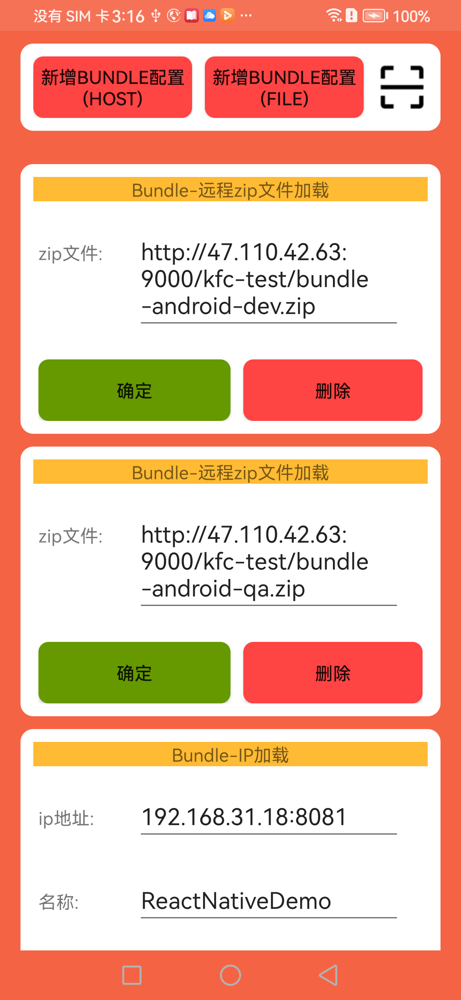

# RN&Andriod工程拆分实践


## RN拆分的意义
> - **技术分工：** 在大型项目中，前端开发和原生开发可能需要不同的技能和知识。拆分工程可以让前端和原生开发团队专注于各自的领域，提高开发效率和质量。
> - **团队协作：** 拆分工程可以实现更明确的团队协作，每个团队专注于自己的工作，减少开发人员之间的干扰，提高团队效率。
> - **独立升级和维护：** 前端工程和原生工程可以独立升级和维护，避免在整个项目中的升级过程中出现问题，降低升级风险。
> - **代码质量和可维护性：** 拆分工程有助于代码的分层和组织，提高代码质量和可维护性。前端和原生部分各自负责，可以更好地维护代码库。
> - **独立开发和测试：** 前端和原生工程可以独立进行开发和测试，减少冲突和影响，提高开发和测试效率。

## RN拆分产生的问题
> - **测试和调试：** 前端工程和原生工程都需要独立进行测试和调试，确保代码质量。处理跨工程的测试和调试如何处理
> - **项目管理：** 两个独立的工程意味着需要更复杂的项目管理和协调。开发、集成、构建、部署等方面的流程可能需要重新定义和协调。
> - **学习成本：** 开发人员可能需要学习和适应两个不同的技术栈，这可能增加学习成本和培训成本

## Android自定义bundle加载

#### android 端启动流程分析
[RN启动流程](https://github.com/sucese/react-native/blob/master/doc/ReactNative%E6%BA%90%E7%A0%81%E7%AF%87/3ReactNative%E6%BA%90%E7%A0%81%E7%AF%87%EF%BC%9A%E5%90%AF%E5%8A%A8%E6%B5%81%E7%A8%8B.md)

标准的RN工程，是用过在MainApplication 初始化 ReactNativeHost来完成的，他最主要的功能就是创建ReactInstanceManager

> - ReactInstanceManager是RN框架中的一个关键类，它用于管理和维护RN的实例。ReactInstanceManager 负责创建和管理RN的JavaScript引擎实例，配置信息，以及协调RN应用的生命周期和状态
> - ReactRootView 实际上是一个FrameLayout 负责创建视图并开启RN应用startReactApplication
> - 宿主Activity中的setContentView(new ReactRootView()) 展示RN-UI

**根据上述分析我们可以自定义bundle的加载**

```java
 @Override
    protected void onCreate(Bundle savedInstanceState) {
        super.onCreate(savedInstanceState);
        SoLoader.init(this, false);

        PackagerConnectionSettings packagerConnectionSettings = new PackagerConnectionSettings(getApplication());
        Intent intent = getIntent();
        String host = intent.getStringExtra("host");
        if (!TextUtils.isEmpty(host)) {
            isDebug = true;
            packagerConnectionSettings.setDebugServerHost(host);
        } else {
            isDebug = false;
        }
        mReactRootView = new ReactRootView(this);
        mReactInstanceManager = ReactInstanceManager.builder()
                .setApplication(getApplication())
                .setCurrentActivity(this)
                .setBundleAssetName("index.android.bundle")
                .setJSMainModulePath("index")
                .setJSIModulesPackage(new ReanimatedJSIModulePackage())
                .addPackages(new ArrayList<>(Arrays.<ReactPackage>asList(
                new MainReactPackage(null),
                new AsyncStoragePackage(),
                new RNCMaskedViewPackage(),
                new RNCConfigPackage(),
                new RNGestureHandlerPackage(),
                new LinearGradientPackage(),
                new SafeAreaContextPackage(),
                new RNScreensPackage(),
                new AMap3DPackage(),
//                new ReanimatedPackage(),
                new VectorIconsPackage(),
                        new ImagePickerPackage()
        )))
                .setUseDeveloperSupport(isDebug)
                .setJSBundleFile(getBundleFilePath())
                .setInitialLifecycleState(LifecycleState.RESUMED)
                .build();
        // The string here (e.g. "MyReactNativeApp") has to match
        // the string in AppRegistry.registerComponent() in index.js
        mReactRootView.startReactApplication(mReactInstanceManager, "ReactNativeDemo", null);
        setContentView(mReactRootView);
    }

```

### bundle加载方式


### 开发调试页面
> - **远程文件加载**
> - **本地调试加载**

<br/>
<br/>



## 打包总体流程


## RN端打包脚本流程

> - **输入打包环境变量**
> - **shell脚本打包压缩**
> - **上传发布到minio&&同步到webhooks(飞书 企微)**


## Native端打包脚本流程
> - **输入打包环境变量**
> - **下载内置bundle**
> - **应用版本号自动更新**
> - **打包apk**
> - **上传发布到firim&&同步到webhooks(飞书 企微)**


