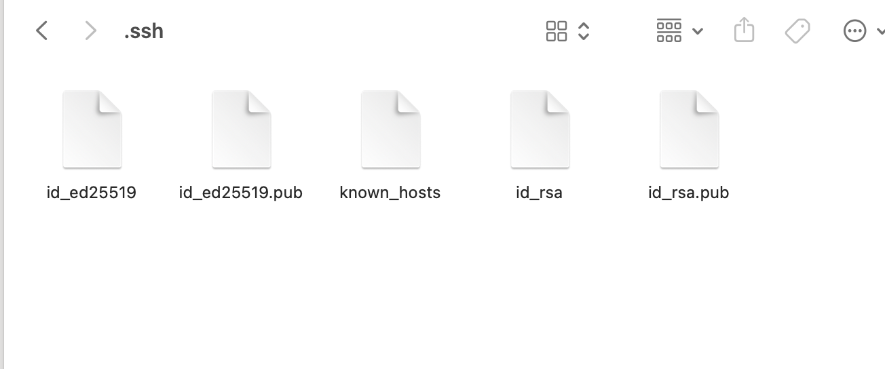
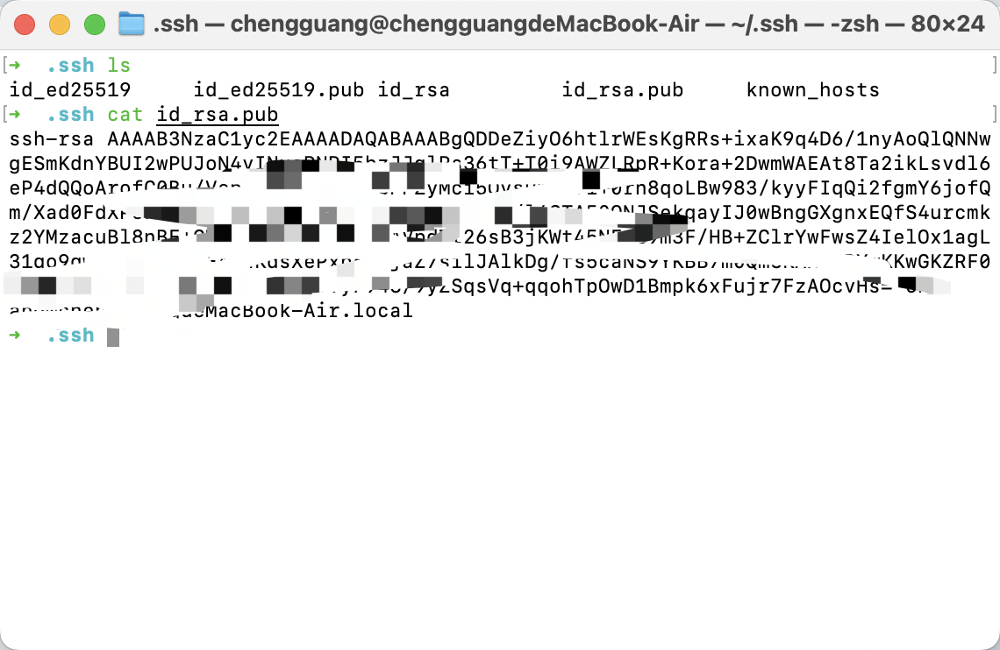
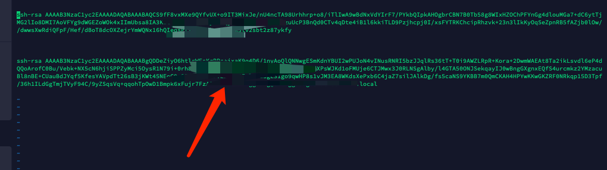

## linux服务器间ssh登录
> - **客户端生成密钥** 

id_rsa: 生成的私钥文件  
id_rsa.pub: 生成的公钥文件  
known_hosts: 已知的主机公钥清单  

## 远程密钥登录

* 1. 通过 ssh-copy-id 命令
* 2. 通过 scp 命令
* 3. 手工复制

我们选择第三种方式：

**先使用 cat 命令查看当前的公钥**

**然后复制，在到目标服务器上去粘贴 /root/.ssh/authorized_keys**

