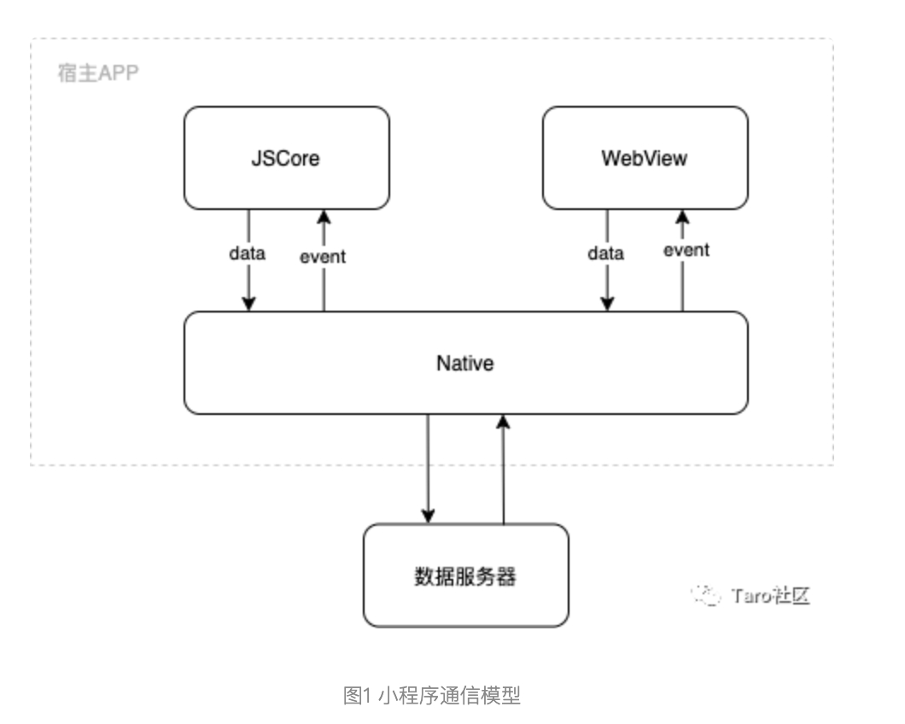
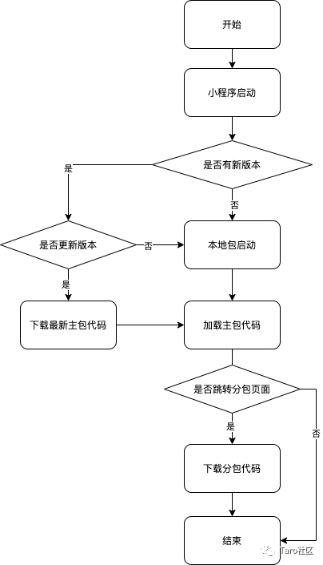
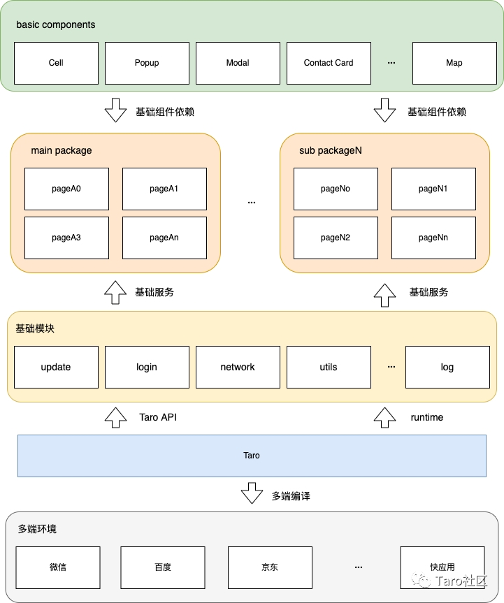
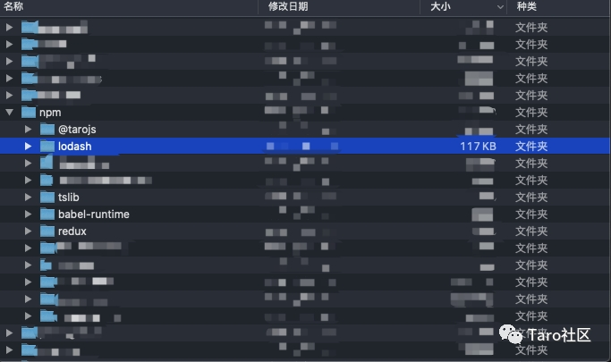
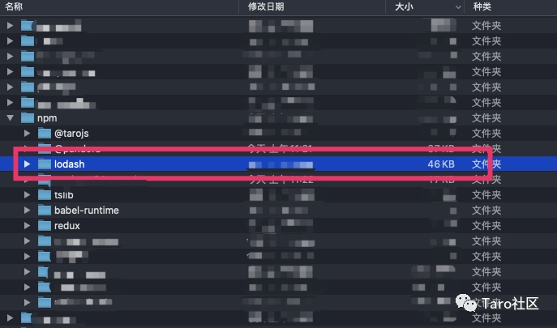

## 背景
> 随着项目规模增大，小程序分包优化是必须要面对的问题。分包不合理，不仅影响项目迭代和上线计划，还关乎用户体验，甚至因此导致 C 端用户流失。本文主要介绍京东快递小程序分包过程中踩过的坑，以及小程序分包优化的一些建议。

## 小程序简介

- 小程序是一种不需要下载安装即可在各类宿主环境（手机 APP、车载系统、IOT 设备等）中使用的应用程序。
- 小程序使用了双线程模型，包括逻辑层和渲染层：逻辑层 JSCore 负责运行 JavaScript 脚本，进行数据处理；渲染层使用 WebView 进行渲染，负责页面展示、处理用户交互。
  
小程序通信模型如图:



## 小程序分包机制

- 小程序的优势之一就是无需下载安装即可运行。在用户打开小程序时，如果是首次使用，或者小程序版本有更新，宿主环境会下载最新代码包，我们称这个包为小程序的“主包”。为优化小程序首次启动下载时间，各小程序平台对主包大小有一定限制，如微信限制主包大小不能超过 2M。

- 为了防止主包超限，以及更好地多人协作，开发人员可以对小程序进行分包，如将一组独立的功能页面作为分包打包，当用户进入分包页面时，宿主环境会动态下载对应分包，极大提高用户体验。小程序平台对分包大小限制为 20M。


小程序包加载流程图如图:




## 项目架构梳理

- 在分包优化前，首先对项目框架有个清晰地梳理，才能更好地明确优化方向。KFC小程序基于 Taro 多端开发框架，适配了微信、支付宝、抖音等多个 APP 渠道。

基础架构图如图:




## 代码依赖分析

依赖分析能帮我们确定项目代码依赖关系，根据依赖关系可以确定分包优化的代码、资源文件等。依赖分析主要有以下两种方式：

- 1. 通过小程序开发者工具的“代码依赖分析”插件，可以查看到各代码包的依赖情况。
  
- 2. 在Taro2.0以上版本中，使用了 Webpack 进行编译构建。可以通过添加 webpack-bundle-analyzer 插件，实现依赖分析的可视化展示。主要步骤如下：

- a. 首先安装  webpack-bundle-analyzer  依赖:

```javascript
  npm install webpack-bundle-analyzer -D
```

- b. 然后在 mini.webpackChain 中添加如下配置：

```
 const config = {
    ...
    mini: {
      webpackChain (chain, webpack) {
        chain.plugin('analyzer')
          .use(require('webpack-bundle-analyzer').BundleAnalyzerPlugin, [])
      }
    }
 }
```

- c. 然后通过运行编译命令，即可查看代码文件依赖关系及体积。


## 小程序打包面临问题

随着需求迭代，KFC小程序主包早已接近阈值 2M，稍有不慎就会超包，影响上线计划。

**京东快递小程序打包面临问题如下：**
- 图片资源过大，影响主包体积；
- 第三方包引入不规范，导致打包后引入冗余代码；
- console、debugger 等测试代码未做优化，需要上线前手动删除；
- 采用运行时而不是构建时进行多端小程序代码兼容；
- 分包难度大，主包涉及寄件、查件等黄金流程页面，分包成本大；
- 分包路径问题，有些页面路径已经给到外部，分包后涉及外部系统改造上线；


## 小程序分包优化实践

本节主要介绍KFC小程序分包优化实践.

#### 图片资源问题

- 小程序主包的体积空间是“寸土寸金”的，建议将图片资源上传到 CDN，优先使用 CDN 图片。如有 tabbar 等必须用本地图片的情况，建议将本地图片压缩后再进行引入
- 分包优化时建议优先处理图片资源，图片压缩可以请 UI 同学协助处理


#### 第三方包引入问题

项目开发中难免会引入第三方工具包，包引入不当会导致打包后体积过大。拿 lodash 举例，原来的引入方式如下

```javascript
  import { get } from 'lodash'
```

上述引入打包结果如图：



可以看到，lodash 包大小为 117KB。

我们优化后的引入方式如下:

```javascript
  import get from 'lodash/get'
  import isEmpty from 'lodash/isEmpty'
```
打包结果如图：



可以看到，优化引入方式后 lodash 包大小只有 46KB，使主包体积减少了 60%。

除了上述优化方法，还可以将 lodash 替换为“lodash-es”，“lodash-es”基于 ESM 打包方式，这样就能利用 tree-shaking 移除不必要的代码，同时还能保留了按需引入的写法。


#### 关于 console、debugger 的打包优化

在原生开发中，项目中的 console、debugger 等调试代码占据了一定主包空间，往往需要上线前手动移除。京东快递小程序基于 Taro 框架开发，在编译构建时提供了代码压缩插件的支持，可以做如下优化配置：


```javascript
 module.exports = {
  env: {
    NODE_ENV: '"production"'
  },
  plugins: {
    uglify: {
      enable: true,
      config: {
        // 配置项同 https://github.com/mishoo/UglifyJS2#minify-options
        compress: {
          drop_console: true,
          drop_debugger: true
        }
      }
    },
  }
}
```

上述是生产环境打包配置文件，在 plugins 新增 uglify 选项，在 config 下新增 compress 配置项，将“drop_console”和“drop_debugger”设置为 true，即可在生产环境打包阶段移除代码中的 console 和 debugger，减少包代码体积。


#### 采用构建时进行多端小程序代码兼容

KFC小程序除了微信端，还适配支付宝和抖音小程序。对于某些只在特定平台才有的功能，采用运行时的适配方法如下：

```javascript
  const isAlipay = process.env.TARO_ENV === 'alipay'
  function test() {
    if (isAlipay) {
      console.log('支付宝小程序特定功能')
    }
  }
```


首先定义了一个全局变量，在运行时判断如果是支付宝小程序平台，执行支付宝小程序相关代码。上述代码构建后的结果如下：

```javascript
  // 支付宝小程序
  const isAlipay = true
  function test() {
    if (isAlipay) {
      console.log('支付宝小程序特定功能')
    }
  }
  // 非支付宝小程序
  const isAlipay = false
  function test() {
    if (isAlipay) {
      console.log('支付宝小程序特定功能')
    }
  }
```

可以看到，在支付宝和非支付宝小程序，只是顶级作用域中 isAlipay 的值不一样，test 函数中代码是没有变化的。

优化后的代码如下：

```javascript
  function test() {
    if (process.env.TARO_ENV === 'alipay') {
      console.log('支付宝小程序特定功能')
    }
  }
```


构建后的结果


```javascript
  // 支付宝小程序
  function test() {
    console.log('支付宝小程序特定功能')
  }
  // 非支付宝小程序
  function test() {}
```

可以看到，通过动态判断 process.env.TARO_ENV，构建后小程序只包含了自己平台相关的代码，大大减少了包体积（请注意区分 process.env.TARO_ENV 和 Taro.getEnv()，前者是编译构建时的变量，后者是运行时的变量）。


#### 主包黄金流程页面分包、分包路径跳转问题

如果要对主包某个页面进行分包，但页面路径已提供给外部，分包改变路径后可能涉及其他系统改造上线。这种情况可以保留主包页面(空白页面)，代码做如下处理

```javascript
export default class PageA extends Taro.Component<Props, State> {
  componentDidMount() {
    try {
      const params = get(this.$router, 'params') || {}
      const paramArr: Array<string> = []
      Object.keys(params).forEach(key => {
        params[key] && paramArr.push(`${key}=${params[key]}`)
      })
      let url = '/packageSub/test/test'
      if (paramArr.length > 0) {
        url = `${url}?${paramArr.join('&')}`
      }
      Taro.redirectTo({ url })
    } catch (e) {}
  }
  render(): JSX.Element {
    return <View></View>
  }
}
```

可以看到，主包 PageA 页面只保留了 componentDidMount 的代码，首先从路由参数中获取 params，参数转换之后通过 redirectTo 路由到分包页面，这样对跳转方是无感知的，同时将 PageA 主体移入了分包页面，减小了主包体积。


## 总结

- 小程序运行在各类宿主环境中，无需安装即可运行。因此保证小程序主包大小，对小程序进行分包优化能极大提升用户体验。

**对小程序分包优化时，要具体情况具体分析。要注意以下几点：**

- 1. 分包优化前，要做好项目框架梳理工作，明确分包方向；然后利用代码依赖分析工具进行包依赖分析，确定要分包的代码、资源文件等；

- 2. 优先处理图片资源加载、第三方包引入问题，然后进行正确打包配置，合理利用 process.env.TARO_ENV 进行平台差异处理，最后再考虑黄金流程页面分包；

- 3. 分包优化是个持续的过程，要培养分包的意识，日常工作按照最佳实践进行开发，才能保证系统稳定。