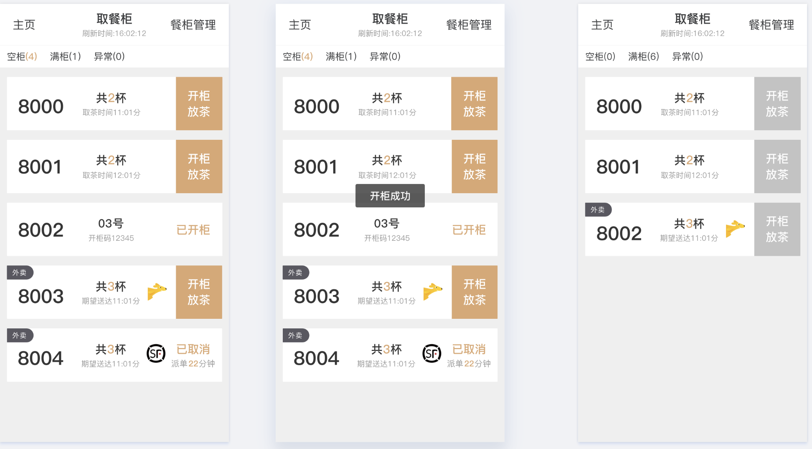
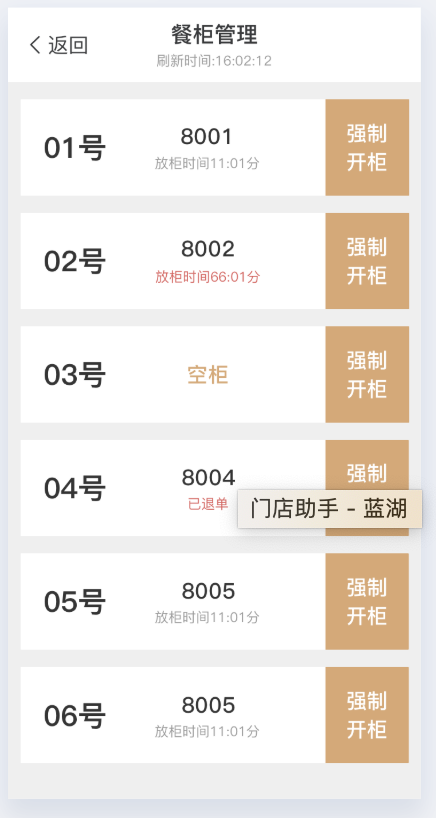
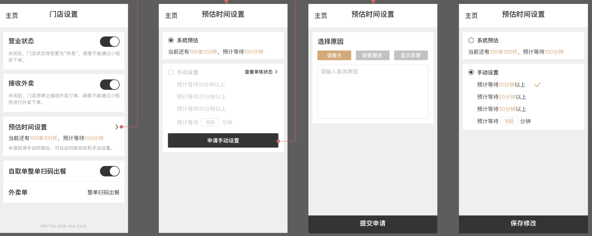
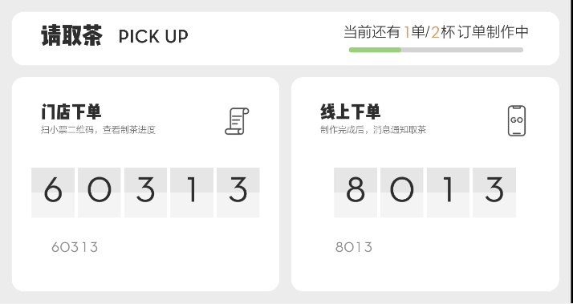
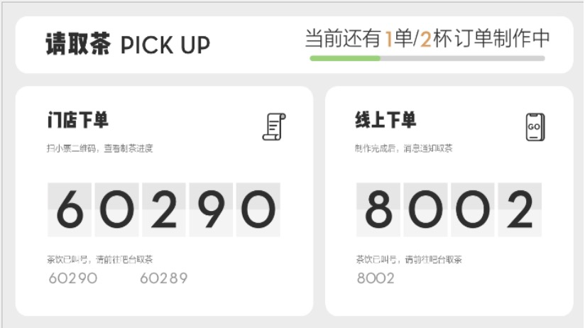

# 2019个人年终述职总结
#### 部门：研发部 姓名：程广

## 总结回顾
**时间一晃而过，转眼又是一年。在这一年的时间里，在领导和同事们的悉心关怀和指导下，通过自身的努力，各方面均取得了一定的进步，现将我的工作情况作如下汇报。**
- 通过日常工作积累使我对公司整体业务流程有了新的认识和一定了解。
- Android开发技能的提升。参与了门店助手--取茶柜模块的开发需求迭代和取餐屏的需求迭代。socket插件封装，现在支付插件等一些原生RN插件封装装，更加深入理解了Android应用层体系。
- 对WEB前端的深入。利用Taro重构小程序项目，学习了CSS、TypeScript，加深了自己对js、ts的理解，继续扩展了技术领域。
- js技术栈
  > - 1.通过阅读redux源码，中间件源码(redux-thunk redux-promise等)对redux有了体系有了更深入的认识，同时也感叹redux编码的精妙。
  > - 2.及时关注RN更新版本，了解新特性新功能
  > - 3.阅读了《你不知道的javascript》《阮一峰ES6语法详解》加深了对js的理解
- 项目自动化的探索实践，工程自动打包发布是开发过程中常见的场景，前期使用了jenkins在本地搭建了环境对Android原生工程和RN工程进行了自动化打包实践。发现jenkins搭建步骤繁琐，同时也占用本机硬盘容量（jenkins会在自己的工作空间拉取项目环境），后来选择了fastlane自动化构建（稍后有详细案例介绍）。
- 对后端的了解，课余时间学习了docker nginx，利用腾讯云服务器搭建了一个简单的负载均衡

## 价值观体现
#### 追求卓越，提高自我:
- 1.Taro 小程序重构当中编码不规范，导致上线运行出现undefined等情况。基于这样的情况，自己去阅读了《你不知道的javascript》（上中下）书籍，观看TS教程视屏，加深自己对js的理解和使用。
- 2.Taro重构完成之后，切换到RN项目开发，这个过程中需要开发原生插件，同时在协助同事钟福才进行面试工作中发现对android原生的认知有所缺陷，于是阅读了《android开发艺术探索》。自己对android整个应用层体系有了进一步了解，对android底层的IPC通信有了深入认识，对自己的知识体系进行了一个查漏补缺。
#### 高效，协同：
- 1.在接触门店助手项目时发现项目中配置了多个环境，每次打包需要手动切换到对应的环境打包，费时费力。前期搭建了Jenkins来进行android打包，发现太重量级了不方便，后期采用fastlane来进行自动化构建省时省力。
- 2.在原生开发过程中遇到问题会及时同对方（钟福才）沟通交换意见想法确定解决方案，提高开发效率；在发版的时候也会相互帮助，帮忙对方发版上线，确保项目正常推进。

## 参与项目模块
|  功能模块 | 成果  | 开发/上线时间 |
|  ----    | ---- |   ----      | 
|  门店助手--取茶柜                       | 一期开发任务，提升门店效率，树立科技化品牌形象  | 2019/03月 开始开发2019/6月中旬 正式上线
| Trao 喜茶GO 重构（会员模块，账号互通）     | 使用组件化开发，ts约束 使得项目结构编码更加清晰；提高小程序的启动耗时，和页面渲染时间。| 2019/6/25 开始 2019/9/28 正式上线
| 门店助手--预估时间设置 | 门店可根据实际情况修改预估时间，提高预报准确率 | 2019/12/10 开始 2019/12/23 上线使用
| 取餐屏--扫码叫号，UI界面优化 | 1.扫码叫号及时提醒用户，提高用户体验 2.优化UI界面使得界面布局更加美观 | 2019/12/1 开始 2019/01/6 上线使用
| 取餐屏RN重构 门店助手RN重构 |	1.取餐屏RN重构（90%  未测试）2.取餐屏RN重构（30% ）3.沉淀下来RN基础工程 | 2019/10 --- 2019/12
| 电子屏RN（星云系统对接）| 1.socket 插件开发完成(托管在公司gitlab) 2.接收登陆指令调试完成3.设备是否录入后台接口对接调试完成 4.一键登录功能调试完成 | 2019/12 月底开始
| Taro 基础包制作 | 1.前端工程和原生端工程剥离，方便开发 2.可按需加载指定服务下的bundle文件 | 
| fastlane自动打包 | 1.android原生多版本自动打包并推送到fir.im 平台，提高打包测试效率 2.RN工程 自动打包bundle推送到codepush sentry(错误监控)平台，自动打包apk 并推送fir.im. |

## 项目功能介绍
### 门店助手--取餐柜模块
#### 模块说明: 释放劳动力，提高顾客取茶效率，增加门店科技感

### 门店助手--预估时间设置
#### 模块说明: 门店可根据实际情况修改预估时间，提高预报准确率

### 门店助手--扫码叫号，UI界面优化
#### UI布局更加美观
#### 优化前

#### 优化后

### fastlane在Android和RN中的使用
[fastlane在Android原生中的使用](https://chenggpbu.github.io/Mobile/Android/android_fastlane.html)  
[fastlane在RN工程中的使用](https://chenggpbu.github.io/Mobile/ReactNative/rn_fastlane.html)

## 自身不足
* 1、知识面太窄。
* 2、和同事领导缺乏沟通交流。

## 2020工作展望
* 1、改善自身不足和同事领导多交流多沟通。
* 2、做好星云系统移动端开发。
* 3、做好取餐屏 门店助手RN重构项目。
* 4、继续学习新技术，努力提高自己的个人能力。为以后能够更好，更顺利的工作奠定基础。
* 5、希望对前端(react h5 less)和后端(java技术栈)有个系统的学习,争取闲暇时间写一个前后端demo部署到云服务。

“业精于勤而荒于嬉”，在以后的工作中我要不断学习业务知识，通过多看、多问、多学、多练来不断的提高自己的各项业务技能。学无止境，时代的发展瞬息万变，各种学科知识日新月异。我将坚持不懈地努力学习各种知识，并用于指导实践。在今后工作中，要努力做好开发人员的本职工作，把自己的工作创造性做好做扎实，为项目的开发以及公司的发展贡献自己的力量。