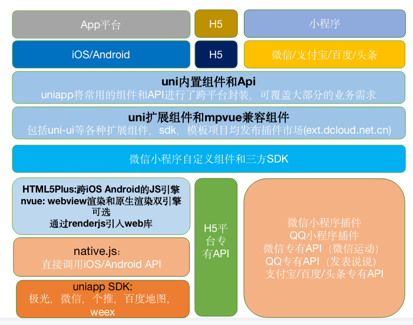
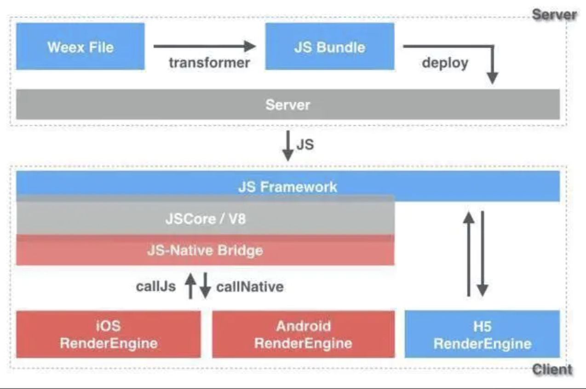
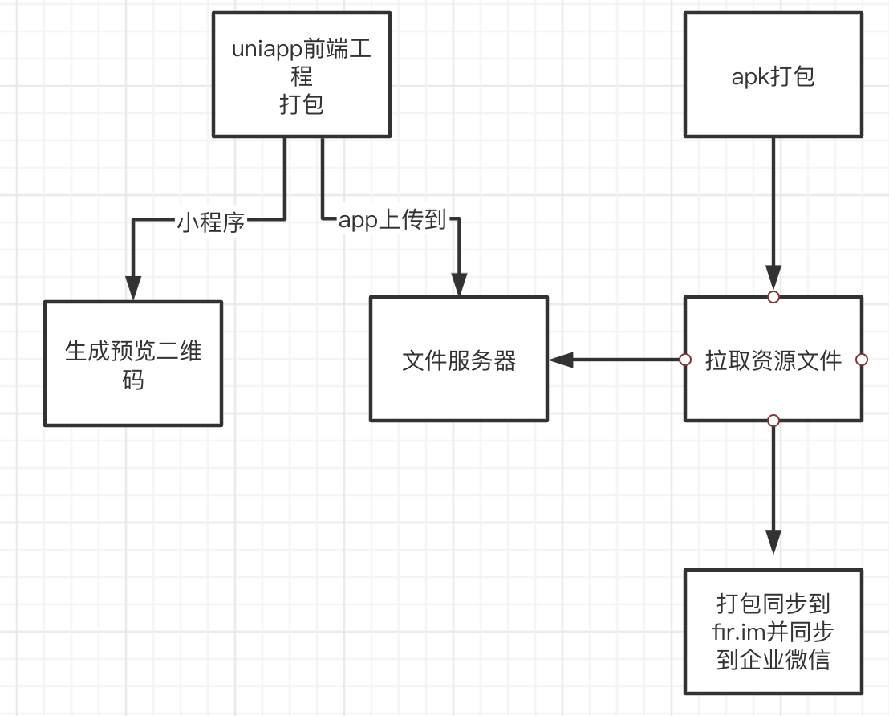

# Uniapp开发总结与分享
***部门：技术开发中心--消费金融 姓名：程广***

### 什么是 UNIAPP，介绍 UNIAPP 用途和技术基本原理

- uni-app 是一个使用 Vue.js 开发所有前端应用的框架，开发者编写一套代码，可发布到iOS、Android、H5、以及各种小程序（微信/支付宝/百度/头条/QQ/钉钉/淘宝）、快应用等多个平台。

- 据 DCloud 称，uni-app在手，**做啥都不愁**。即使不跨端，uni-app也是更好的小程序开发框架（详见）、更好的App跨平台框架、更方便的H5开发框架。不管领导安排什么样的项目，都可以快速交付，不需要转换开发思维、不需要更改开发习惯。

- 据 DCloud 称，很多人以为小程序是微信先推出的，其实 DCloud 才是这个行业的始作俑者。DCloud于2012年开始研发小程序技术，优化webview的功能和性能，并加入W3C和HTML5中国产业联盟，推出了HBuilder开发工具，为后续产业化做准备。2015年，DCloud正式商用了自己的小程序，产品名为“流应用”，它不是B/S模式的轻应用，而是能接近原生功能、性能的动态App，并且即点即用。

### 功能架构图
- 编译到小程序能力通过缝合美团前端团队的mp-vue实现。
- 原生渲染能力通过缝合阿里巴巴团队的weex实现。
- uniapp提供向微信小程序看齐的内置组件和api。

### Weex的工作原理

> Weex是一套支持跨平台、动态更新的使用Javascript进行原生APP开发的解决方案。 Weex的终极目标是带来iOS端、Android端和H5端一致的开发体验与代码复用。

***同RN原生通信原理一样***

### Weex与H5 Hybird比较

- ***以前***，实现一个需求，需要三种程序员(iOS，android，前端)写三份代码，这就带来了很大的开发成本，所以业界一直在探索跨平台技术方案。从之前的Hybrid，到现在的Weex，React Native，这些方案的根本目的都是一套代码，多端运行。
- H5 Hybrid方案的本质是利用客户端APP的内置浏览器功能(即webview)，通过JSBridge实现客户端Native和前端JS的通信问题，然后开发H5页面内嵌于APP中，该方案提升了开发效率，也满足了跨端的需求，但是有一个问题就是，前端H5的性能和客户端的性能相差甚远。
- Weex采取前端技术栈的开发方式，同时在终端的运行体验不输Native App。weex利用Native的能力去做了部分浏览器去做的工作。

### 混合开发比较
|   --   |  Weex | ReactNative | Taro | Native | H5 |
|  :----:  | :----: |  :----:  | :---: | :--: | :---: |
|  开发语言  | js+css |  js+flex布局 | js+css | oc/swift/java/kt | js+css |
|  跨平台  | 三端可用 |  iOS/Android/支持web需要工具转换 | 三端可用 | 自己平台 | 三端可用 |
|  热更新  | 支持 |  支持  | 支持 | 支持 | 支持 | 
|  渲染机制  | weex原生渲染 |  Yoga引擎渲染 | 移动端依赖于RN | --- | 浏览器DOM渲染 |
|  异步  | callback |  callback  promise  | 同RN |  | |
|  上手难度  | 容易 |  容易  | 容易  | 困难 | 容易 |

### 开发过程中的问题
- 对原生开发不够友好，调试麻烦，每次打包都需要云端打包（每天限制次数）很耗时，超过次数需要付费
- 对原生的集成度很高，高度定制化，插件付费
  - 集成了百度地图，我想用高德
  - 集成了个推，我想用极光
  - 集成了微信 QQ 微博分享，我想分享到抖音
  - Anroid权限问题，默认强制读取设备信息
- 正在开发其他项目，突然测试同事需要打包

### 解决方案
- 自定义基座，自定义插件，通过插件的方式扩展调用原生功能
- 自定义打包脚本方便开发调试，方便相互协同开发

### 本地打包流程
[nodejs交互工具库](https://segmentfault.com/a/1190000037629594)  

***打包流程(具体按照uniapp打包讲解演示)***

